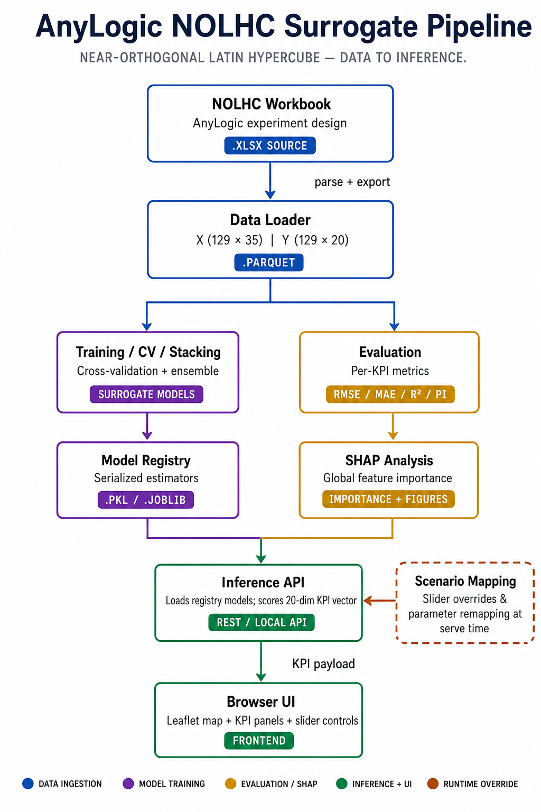

# Due Diligence Report

## NOLHC ML Engine with SHAP Explainability Layer

| Field | Detail |
|-------|--------|
| **Project title** | NOLHC ML Engine — Surrogate Modelling and Decision-Support UI for Post-Brexit Ireland–GB–EU RoRo Logistics |
| **Programme** | [Programme Name] |
| **Module** | Business Consulting Project (BCP) — Final Semester |
| **Document type** | Due Diligence Report |
| **Date** | [Submission Date] |
| **Author(s)** | |
| **Supervisor / Mentor** | |

---

## 1. Abstract

This due diligence report reviews the NOLHC ML Engine developed for the Business Consulting Project. The work sits on top of an AnyLogic discrete-event simulation of post-Brexit roll-on/roll-off (RoRo) freight between Ireland, Great Britain, and the EU. Stakeholders need to compare route choices, staffing levels, and border-check policies without waiting for a full simulation run each time.

The engine treats a Nearly Orthogonal Latin Hypercube (NOLHC) design of 129 completed simulation runs as training data. From 35 continuous inputs it predicts 20 operational KPIs. A multi-model training pipeline benchmarks a wide set of regressors per KPI, registers the best model (or stacking ensemble), and exposes predictions through a local API and browser UI. A SHAP explainability layer was added so that users can see which inputs drive a chosen KPI for a given scenario. Scenario families for Direct Route and Non-Tariff Barrier settings allow structured “what-if” exploration under parameter governance rules.

Overall, the system is in a usable academic handover state: models are trained, evaluation workbooks exist, SHAP outputs are available, and two UI paths are runnable locally. Remaining risks are the small sample size (129 runs), weaker generalisation on a small number of KPIs, and the need for mentor confirmation on publication framing and any further data from the simulation partner. The longer-term academic aim is to turn this consulting delivery into a journal-ready paper on surrogate modelling, explainability, and human-on-the-loop decision support for logistics simulation.

---

## 2. Introduction

Brexit changed the cost and friction of moving freight through the UK landbridge. For Ireland, that means operators and policy analysts must weigh landbridge routes against more direct EU sailings, while also thinking about customs and Department of Agriculture, Food and the Marine (DAFM) capacity at Dublin and Rosslare. The underlying AnyLogic model can answer these questions, but it is heavy: many parameters, long run times, and limited room for interactive exploration in a meeting.

The NOLHC ML Engine was built as a practical response to that gap. Instead of re-running the full simulation for every slider move, the team trained surrogate models on a designed set of 129 simulation experiments and wrapped them in a lightweight interface. The consulting question is straightforward: can a transparent, explainable ML layer give stakeholders fast KPI estimates that are close enough to the simulation for early scenario screening, while keeping a human expert in charge of assumptions?

This report documents what was built, how it works, what evidence we have so far, where the boundaries of the work sit, and what still needs mentor guidance. It is written for BCP assessment. An appendix sets out possible objectives for a later journal publication so that the same body of work can be shaped for peer review without rewriting the consulting narrative from scratch.

Ethics for the project are taken from the Academy of Management Code of Ethics and the ACM Code of Ethics and Professional Conduct (see Section 9 and References). In short: we treat the simulation outputs as research data under agreed use, we do not oversell model accuracy, we keep decision authority with the human user, and we document methods so that results can be checked.

---

## 3. Project Objective

### 3.1 Business Consulting Project (BCP) objective

The primary BCP objective is to deliver a working due-diligenceable decision-support prototype that:

1. **Reduces iteration cost** — predicts the simulation’s 20 KPIs from the 35 NOLHC inputs in near real time, so scenario discussion does not depend on a full AnyLogic re-run for every change.
2. **Preserves credibility** — selects models per KPI using cross-validation and hold-out evaluation, and reports where performance is strong and where it is weak.
3. **Supports explanation** — adds SHAP so that KPI movements can be linked back to input drivers in language that mentors and domain reviewers can challenge.
4. **Keeps humans in control** — presents scenarios and sliders inside a governed UI; the tool advises, it does not replace expert judgement.
5. **Leaves a clear handover trail** — repository layout, training/evaluation scripts, Excel masters, and specs that another analyst can reopen.

### 3.2 Link to journal publication (high level)

A secondary, forward-looking objective is to package the same work for academic publication. Candidate contribution themes (method, evaluation under small designed samples, XAI for logistics KPIs, and interactive decision support) are expanded in **Appendix A**. The BCP report itself remains consulting-led; the appendix is the bridge to a paper outline.

---

## 4. System Overview

At a high level the system has four layers:

| Layer | What it does |
|-------|----------------|
| **Data** | Takes the NOLHC AnyLogic export (129 runs × 35 inputs × 20 KPIs), validates it, and stores processed parquet matrices for training. |
| **Modelling** | Trains and compares many regressors per KPI, optionally builds stacking ensembles, and registers winners with metrics. |
| **Explainability** | Runs SHAP on selected models; produces importance tables, plots, and review crosswalks for domain checking. |
| **Decision UI / API** | Serves predictions to a browser UI (parameter exploration and/or scenario-family exploration) over a local HTTP API. |

Two related codebases sit in the same project:

- **`nolhc_ml/`** — production-style FastAPI engine, model registry (v1), parameter UI, and Excel evaluation reports.
- **`experimenting_ml/`** — mentor-facing experimental pipeline (CV, SHAP, conformal-style intervals, master workbooks) and Decision Intelligence UI for scenario families.

An earlier corridor engine (`brexit_ml/`) exists as predecessor work and is treated as superseded for this NOLHC scope.

Typical user flow:

1. Choose a baseline scenario (As-Is / Scenario 1 / Scenario 2) or set the 35 inputs directly.
2. Adjust governed sliders (route splits, border checks, staffing-related parameters, as allowed).
3. Call the prediction API and read KPI cards (transit times, waiting times, utilisations).
4. Optionally inspect SHAP drivers for a focus KPI before accepting or rejecting the scenario story.

---

## 5. Technical Architecture

### 5.1 Logical architecture

```
AnyLogic NOLHC workbook (xlsx)
        │
        ▼
Data loader → X (129×35), Y (129×20) parquet
        │
        ├──► Training / CV / stacking ──► Model registry (.pkl / .joblib)
        │                                      │
        │                                      ├──► Evaluation (RMSE, MAE, R², intervals)
        │                                      └──► SHAP (importance + figures)
        │
        └──► Inference API  ←── Scenario mapping / slider overrides
                    │
                    ▼
              Browser UI (Leaflet map + KPI panels)
```

**Figure 1.** End-to-end AnyLogic NOLHC surrogate pipeline (data ingestion → training / evaluation & SHAP → inference API and browser UI, with scenario mapping as a runtime override).



### 5.2 Modelling approach

For each of the 20 KPIs the pipeline benchmarks a broad candidate set (Gaussian Process variants, tree ensembles including Random Forest / Extra Trees / Gradient Boosting / XGBoost / LightGBM / CatBoost, SVR, polynomial pipelines, linear/penalised models, KNN, MLP, AdaBoost). Selection uses cross-validation on the training pool. In `nolhc_ml`, a stacking ensemble is compared with the best single model and the stronger of the two is registered.

Hold-out design used for reported evaluation: **103 train / 26 test** (approximately 80/20), random seed 42. Scaling (`StandardScaler`) is fit on training rows only for models that need it; tree models use unscaled inputs.

### 5.3 Inference and UI

- **`nolhc_ml`:** FastAPI application (`uvicorn`) with endpoints such as `POST /predict`, health and metadata routes; static UI under `nolhc_ml/ui/`.
- **`experimenting_ml`:** local inference server (`run_ui_inference_api.py`) serving the mentor scenario UI, with fields for scenario family, level, slider overrides, and focus target for SHAP.

### 5.4 Explainability layer

SHAP is applied to the selected model per target (`experimenting_ml` Step 4). Tree models use TreeExplainer where appropriate; other models use a generic SHAP explainer. Outputs include per-target importance CSVs, standard plot types (beeswarm / bar / waterfall), and master Excel packs. A plain-language crosswalk (`docs/NOLHC_XAI_crosswalk.md`) maps code names to SIG-style groups so reviewers can mark drivers as expected, surprising, or red-flag before stakeholder text is written. An optional LLM attribution snapshot layer exists as a schema/persona design that consumes structured SHAP summaries rather than free-form model access.

---

## 6. Dataset

### 6.1 Source and design

| Item | Detail |
|------|--------|
| Design name | Nearly Orthogonal Latin Hypercube (NOLHC) |
| Source workbook | `NOLHC_Designs_-_AL_Students.xlsx` (project copy: `nolhc_ml/data/raw/nolhc_runs.xlsx`) |
| Complete runs | **129** |
| Inputs | **35** continuous design parameters |
| Outputs | **20** continuous KPIs |
| Missing / zero-inflation | Processed matrices asserted complete (no NaNs); design avoids the zero-inflation issues of the predecessor set |
| Orthogonality note | Column correlations of the design matrix are documented in project materials as roughly within (−0.3, 0.3) |

### 6.2 Input groups (35 parameters)

Inputs are grouped for modelling and UI in line with the SIG presentation structure:

1. **Trade volume** — agri and non-agri import/export tonnes (`NA_Im`, `NA_Ex`, `A_Im`, `A_Ex`).
2. **Direct routes vs landbridge** — shift volumes, LB/DR volumes, and vessel capacities on Dublin/Rosslare–GB links.
3. **Customs expertise and resources** — document/physical check times; customs shed and DAFM bay counts at Dublin and Rosslare.
4. **Border-check intervention** — green/red/pre-board routing fractions for inbound and outbound flows.

### 6.3 Output KPIs (20)

KPIs fall into four consulting-facing categories:

- **Agri** — transit and waiting times for agricultural flows.
- **Non-agri** — waiting times for non-agricultural flows at key nodes.
- **Routes** — landbridge and direct-route transit/wait times (inbound/outbound).
- **Staff utilisation** — customs and DAFM utilisation at Dublin and Rosslare (fractions).

Units are hours for time KPIs and fractions for utilisation. Scales differ sharply across targets (short waits vs long landbridge inbound times), which is one reason the team selected models **per KPI** rather than forcing a single global regressor.

### 6.4 Data handling notes for diligence

- Raw Excel is treated as immutable source; processed parquet is the training surface.
- The surrogate only knows the NOLHC design hull. Inputs far outside training ranges are a known extrapolation risk; the UI/governance layer clips or warns where implemented.
- No personal data are used. The dataset is simulation output under project/partner arrangements, not live commercial transaction data.

---

## 7. Scenario Model and KPI Framework

### 7.1 KPI framework

The KPI set is the SimResults vector from the NOLHC design. For diligence and UI presentation it is useful to keep the four buckets above (Agri, Non-Agri, Routes, Utilisation). Prediction quality is judged with RMSE, MAE, and R² on CV and hold-out, plus interval width where conformal / residual-based 90% intervals are reported.

### 7.2 Scenario model (mentor Decision Intelligence UI)

Scenario exploration is organised as:

| Dimension | Options |
|-----------|---------|
| **Scenario family** | Direct Route (`routes`) · Non-Tariff Barrier (`border`) |
| **Level** | As-Is · Scenario 1 · Scenario 2 (from scenario Excel workbooks) |
| **Overrides** | Dynamic sliders mapped from Excel aliases to NOLHC column names |

Governance rules (documented in the mentor UI parameter governance spec) matter for consulting credibility:

- Some groups are locked under certain families (for example, Direct Route locking trade-volume controls while allowing LB/DR and border-related edits).
- Values are kept within training-feasible bounds where clipping is implemented.
- Focus KPI selection drives which SHAP explanation the user sees first.

This is intentional: the product is not an open “move any of 157 cloud parameters” toy. It is a bounded scenario screen for the 35-factor NOLHC surface.

---

## 8. Progress to Date

Work completed and evidenced in the repository includes:

1. **Data pipeline** — load, validate, and write processed `X_train` / `Y_train` parquet; training column contracts locked in code.
2. **Multi-model training (`nolhc_ml` v1)** — 19-candidate benchmarking, stacking comparison, registry of 20 registered models (trained and versioned in the models folder).
3. **Evaluation pack** — markdown/JSON/Excel evaluation reports with train, test, and CV metrics; residual summaries; 90% prediction interval half-widths on the reported evaluation path.
4. **Experimental mentor pipeline (`experimenting_ml`)** — ordered steps for CV, mentor Excel analyses, SHAP, conformal/pre-test steps, retrain/evaluate scripts, and master workbooks (`pipeline_results.xlsx`, SHAP masters, test evaluation narrative).
5. **SHAP / XAI** — per-target importance artefacts, figures, crosswalk documentation, and domain-review helpers.
6. **UIs** — parameter UI on the FastAPI stack; scenario-family Decision Intelligence UI on the experimenting stack.
7. **Documentation** — engine specs, UI specs, experimental analysis report, XAI crosswalk, submission package READMEs, and an early ICML-style paper scaffold under `docs/paper/`.

### 8.1 Headline performance snapshot (`nolhc_ml` v1 evaluation)

On the registered v1 models (103/26 split, 5-fold CV on the training logic described in the evaluation report):

- Many agri, wait, landbridge, and utilisation KPIs show **strong hold-out R²** (examples in the evaluation report include inbound agri transit ≈ 0.95 test R² and several utilisation/wait targets above ≈ 0.85–0.95).
- Stacking was competitive and won a substantial share of targets in the registry narrative.
- **Known weak spots** that must be disclosed in any diligence or paper draft:
  - `WT_IB_NA_Ross` — very low test R² (around 0.05 in the v1 report).
  - `TT_IB_DR` — negative test R² in the v1 report (model not useful for screening as things stand).
  - `TT_OB_DR` — moderate/fragile performance relative to the stronger KPIs.

These weak targets are not hidden in the appendix for show; they are part of the honest scope of the system today.

---

## 9. Current Status and Scope

### 9.1 Current status

| Area | Status |
|------|--------|
| Surrogate training & registry | Implemented (v1 artefacts present) |
| Local prediction API | Implemented |
| Parameter UI | Implemented |
| Scenario UI + governance | Implemented in experimenting path |
| SHAP layer | Implemented with review artefacts |
| Excel/reporting handover | Implemented |
| Live cloud deployment | Out of current academic scope (localhost handover) |
| Live LLM narrative in production UI | Optional/specced; not required for core diligence claim |
| Partner sign-off on operational use | Pending mentor / stakeholder process |

### 9.2 In scope

- NOLHC 35→20 surrogate modelling and evaluation.
- Explainability for selected models.
- Local decision-support UI for screening scenarios.
- Documentation suitable for BCP assessment and academic mentor review.
- Preparation notes for journalisation (Appendix A).

### 9.3 Out of scope (current boundary)

- Replacing AnyLogic for final operational decisions.
- Modelling outside the 35 NOLHC factors / 129-run hull without new design points.
- Guaranteeing equal accuracy on all 20 KPIs (evidence shows this is not true today).
- Collecting or processing personal data.
- Commercial SLA, multi-user auth, or production MLOps beyond local registry files.

### 9.4 Ethics code followed

This project follows two professional codes in parallel:

1. **Academy of Management Code of Ethics**  
   [https://aom.org/About-AOM/AOM-Code-of-Ethics.aspx](https://aom.org/About-AOM/AOM-Code-of-Ethics.aspx)  
   Relevant commitments for this BCP: honesty in reporting results (including weak KPIs), respect for intellectual property and partner simulation assets, avoidance of misleading claims about decision impact, and fairness in how student/group contributions are represented.

2. **ACM Code of Ethics and Professional Conduct**  
   [https://www.acm.org/code-of-ethics](https://www.acm.org/code-of-ethics)  
   Relevant commitments: contribute to society and human wellbeing (better-informed logistics discussion), avoid harm from overconfident automation, be honest about system limitations, respect privacy (no personal data in this pipeline), and maintain professional competence through documented methods and reproducible evaluation.

**Practical ethics controls in the build:**

- Human-on-the-loop UI; no automated policy execution.
- Explicit disclosure of poor-performing KPIs.
- Immutable raw data file; processed derivatives are regenerable.
- Explainability artefacts for challengeable attributions.
- Local-first tooling to reduce unnecessary data movement.

---

## 10. Technology Stack

| Layer | Choices |
|-------|---------|
| Language | Python 3.10+ |
| ML / stats | scikit-learn, XGBoost, LightGBM, CatBoost, NumPy, SciPy, SHAP, Matplotlib |
| Data | pandas, pyarrow (parquet), openpyxl (Excel) |
| Persistence | joblib / pickle model files; JSON registries |
| API | FastAPI, Uvicorn, Pydantic (`nolhc_ml`); stdlib threading HTTP server for mentor UI path |
| Front end | HTML / CSS / Vanilla JS (ES modules); Leaflet for map context in the NOLHC UI |
| Environment | Local virtualenv; no mandatory cloud database |

Dependency pins differ slightly between `nolhc_ml/requirements.txt` and `experimenting_ml/requirements.txt`. For shipped experimenting joblibs, the mentor notes emphasise matching the scikit-learn version used at train time (commonly 1.3.2 in that package’s guidance).

---

## 11. Repository and Workflow

### 11.1 Repository map

```
Final Brexit ML Design/
├── nolhc_ml/                 # FastAPI surrogate + parameter UI + v1 models
├── experimenting_ml/         # Mentor pipeline, SHAP, scenario UI
├── brexit_ml/                # Predecessor (superseded for NOLHC scope)
├── docs/                     # Specs, XAI, paper draft, this report
└── submission_package*/      # Handover bundles
```

### 11.2 Typical workflows

The full project structure described below is published in an open GitHub repository so that mentors and assessors can clone the codebase and reproduce the local workflows, evaluation artefacts, and UI demos: **[https://github.com/nilashree28-wq/NOLHC-ML-Engine](https://github.com/nilashree28-wq/NOLHC-ML-Engine)**. Following the steps in this section on a fresh clone should be enough to reinstall dependencies and regenerate the results summarised in this report.

**A. Run the NOLHC API + parameter UI**

```bash
cd nolhc_ml
source .venv/bin/activate   # if used
pip install -r requirements.txt
# optional: python src/train.py
# optional: python src/evaluate.py && python src/evaluate_to_excel.py
uvicorn main:app --host 0.0.0.0 --port 8000 --reload
# open http://127.0.0.1:8000/
```

**B. Run the mentor scenario UI**

```bash
cd experimenting_ml
pip install -r requirements.txt
python run_ui_inference_api.py --port 8000
# open http://127.0.0.1:8000/UI/index.html
```

**C. Rebuild experimental evidence (ordered)**

CV → mentor Excel steps → pre-conformal → SHAP → retrain/evaluate → test-set narrative → master Excel / SHAP top-feature report.

Exact script names live under `experimenting_ml/` (`run_step1_cv.py`, `run_step4_shap.py`, `run_test_set_evaluation_final.py`, and related runners).

### 11.3 Key artefacts for assessors

- `nolhc_ml/models/v1/evaluation_report.md` / `.xlsx`
- `experimenting_ml/docs/Experimental_Analysis_Report_Mentor.md`
- `experimenting_ml/outputs/` (pipeline and SHAP masters)
- `docs/ml/spec/nolhc_ml_engine_spec.md`
- `docs/ui/NOLHC_ML_UI_Spec.md`
- `docs/NOLHC_XAI_crosswalk.md`

---

## 12. Open Questions for Mentor

These are the points where mentor input would most improve both the BCP mark and any later paper:

1. **Publication target** — Prefer a methods/ML venue, an OR/simulation journal, or a logistics/decision-support journal? That choice changes the weight of SHAP vs UI vs surrogate accuracy.
2. **Weak KPIs** — Should `WT_IB_NA_Ross` and `TT_IB_DR` be excluded from stakeholder screens, flagged with hard warnings, or held for a second design wave of AnyLogic runs?
3. **Additional design points** — Is there a path to more than 129 NOLHC runs (or a focused follow-on design) before journal submission?
4. **Authoritative UI path** — For assessment and demos, should we standardise on `nolhc_ml` (parameter UI) or `experimenting_ml` (scenario families), or keep both with a clear “primary demo” label?
5. **Conformal intervals in the UI** — Are prediction intervals required on-screen for the BCP demo, or is workbook-level reporting enough?
6. **Partner voice** — What attribution and acknowledgement wording is approved for the simulation owner / industry partner in the final report and paper?
7. **Ethics sign-off** — Any local university research-ethics checklist beyond AOM + ACM that must be attached to the submission?
8. **Journal objective lock** — Which one or two candidate objectives in Appendix A should become the official paper claim for the next drafting cycle?

---

## 13. Conclusion

The NOLHC ML Engine is a coherent consulting deliverable: a designed simulation sample, a careful multi-model surrogate, local APIs and UIs for scenario screening, and a SHAP layer that makes KPI drivers inspectable. Diligence findings are balanced. Strengths include a clean 35→20 problem formulation, broad model benchmarking, reproducible evaluation artefacts, and explicit human oversight. Limits are equally clear: small *n*, uneven KPI quality, and localhost rather than production operations.

For the BCP, the system is ready to be assessed as a decision-support prototype with documented methods and ethics stance (AOM and ACM). For journal publication, the same evidence base is promising but not yet a finished paper: the contribution needs a sharper single claim, a cleaner comparison story, and mentor agreement on venue and on how weak targets are handled. Appendix A sets out candidate objectives so that conversation can start from options rather than a blank page.

---

## 14. References

Academy of Management (n.d.) *AOM Code of Ethics*. Available at: https://aom.org/About-AOM/AOM-Code-of-Ethics.aspx (Accessed: 20 July 2026).

Association for Computing Machinery (2018) *ACM Code of Ethics and Professional Conduct*. Available at: https://www.acm.org/code-of-ethics (Accessed: 20 July 2026).

Breiman, L. (2001) ‘Random forests’, *Machine Learning*, 45(1), pp. 5–32.

Chen, T. and Guestrin, C. (2016) ‘XGBoost: a scalable tree boosting system’, *Proceedings of the 22nd ACM SIGKDD International Conference on Knowledge Discovery and Data Mining*. New York: ACM, pp. 785–794.

Cioppa, T.M. and Lucas, T.W. (2007) ‘Efficient nearly orthogonal and space-filling Latin hypercubes’, *Technometrics*, 49(1), pp. 45–55.

Kleijnen, J.P.C. (2015) *Design and Analysis of Simulation Experiments*. 2nd edn. New York: Springer.

Lundberg, S.M. and Lee, S.-I. (2017) ‘A unified approach to interpreting model predictions’, *Advances in Neural Information Processing Systems*, 30, pp. 4765–4774.

McKay, M.D., Beckman, R.J. and Conover, W.J. (1979) ‘A comparison of three methods for selecting values of input variables in the analysis of output from a computer code’, *Technometrics*, 21(2), pp. 239–245.

Pedregosa, F., Varoquaux, G., Gramfort, A., Michel, V., Thirion, B., Grisel, O., Blondel, M., Prettenhofer, P., Weiss, R., Dubourg, V., Vanderplas, J., Passos, A., Cournapeau, D., Brucher, M., Perrot, M. and Duchesnay, É. (2011) ‘Scikit-learn: machine learning in Python’, *Journal of Machine Learning Research*, 12, pp. 2825–2830.

Prokhorenkova, L., Gusev, G., Vorobev, A., Dorogush, A.V. and Gulin, A. (2018) ‘CatBoost: unbiased boosting with categorical features’, *Advances in Neural Information Processing Systems*, 31, pp. 6638–6648.

Rasmussen, C.E. and Williams, C.K.I. (2006) *Gaussian Processes for Machine Learning*. Cambridge, MA: MIT Press.

Ribeiro, M.T., Singh, S. and Guestrin, C. (2016) ‘“Why should I trust you?”: explaining the predictions of any classifier’, *Proceedings of the 22nd ACM SIGKDD International Conference on Knowledge Discovery and Data Mining*. New York: ACM, pp. 1135–1144.

Shafer, G. and Vovk, V. (2008) ‘A tutorial on conformal prediction’, *Journal of Machine Learning Research*, 9, pp. 371–421.

Van Stein, B., Wang, H., Kowalczyk, W., Emmerich, M. and Bäck, T. (2020) ‘Cluster-based Kriging approximation algorithms for complexity reduction’, *Applied Intelligence*, 50, pp. 778–791. *(Surrogate-modelling context reference — replace/extend with supervisor reading list as needed.)*

---

# Appendix A — Journal Readiness and Candidate Paper Objectives

This appendix is not the BCP marking spine. It is a working note so the consulting delivery can be turned into a journal manuscript without losing the project’s real contribution.

## A.1 Why the work is publication-candidate material

The project combines four elements that journals in OR, simulation, applied ML, or decision support often look for together:

1. A **designed simulation experiment** (NOLHC) rather than an ad-hoc scrape of runs.
2. A **multi-output surrogate** with systematic model selection under small *n*.
3. **Post-hoc explainability** (SHAP) tied to logistics KPIs, not only accuracy tables.
4. A **human-on-the-loop UI** that turns the surrogate into a consulting artefact.

## A.2 Possible paper objectives (choose one primary + one secondary)

**Objective 1 — Surrogate accuracy under NOLHC logistics designs**  
Demonstrate that per-KPI model selection (and stacking where helpful) can recover AnyLogic KPIs for post-Brexit RoRo scenarios with quantified hold-out error, and report failure cases honestly.

**Objective 2 — Explainable surrogate decision support**  
Show that SHAP attributions on the surrogate align (or fail to align) with domain expectations for Direct Route and Non-Tariff Barrier scenarios, using the XAI crosswalk as a review protocol.

**Objective 3 — Human-on-the-loop screening workflow**  
Evaluate the UI/API as a decision-support intervention: time-to-insight versus full simulation, governance of editable parameters, and expert acceptance of flagged weak KPIs.

**Objective 4 — Uncertainty-aware screening**  
Centre the contribution on conformal / residual-based intervals for logistics KPIs under small designed samples, and discuss when intervals are wide enough that the UI should refuse a crisp recommendation.

**Objective 5 — Method comparison note**  
A shorter paper comparing tree ensembles, GPR, and regularised linear models on this 129×35×20 surface, with clear guidance on which KPI families favour which model class.

## A.3 Suggested primary claim for the next draft (recommended starting point)

> Under a 129-run NOLHC design of a post-Brexit Ireland–GB–EU RoRo simulation, a per-target surrogate ensemble can support interactive KPI screening with SHAP-based driver inspection, provided weak targets are disclosed and human experts retain authority over scenario assumptions.

This claim is faithful to the evidence and avoids promising “full simulation replacement.”

## A.4 Gaps to close before submission

| Gap | Why it matters |
|-----|----------------|
| Venue choice | Methods vs application journals want different depth. |
| Related work rewrite | Need supervisor-approved simulation-surrogate and XAI logistics citations beyond the starter list. |
| Weak-KPI policy | Reviewers will ask what you do with negative / near-zero R² targets. |
| Single demo path | Paper figures should come from one canonical UI/workflow. |
| Reproducibility pack | Seed, split indices, dependency pins, and one “reproduce evaluation” script path. |
| Partner permissions | Figures and acknowledgement text cleared for public release. |

## A.5 Mapping from this due diligence report to a paper outline

| Paper section | Pull from |
|---------------|-----------|
| Introduction | Sections 2–3 |
| Problem / simulation setting | Sections 4, 6–7 |
| Method | Sections 5, 10–11 |
| Experiments | Section 8 + evaluation Excel/markdown artefacts |
| Explainability | Section 5.4 + SHAP outputs + crosswalk |
| Discussion / limitations | Sections 9 and 12 |
| Ethics statement | Section 9.4 + AOM/ACM references |

## A.6 Next actions (after mentor answers Section 12)

1. Lock primary and secondary objectives from A.2.  
2. Draft a 1–2 page extended abstract.  
3. Build one camera-ready results table (all 20 KPIs, test R²/RMSE, model name).  
4. Select 2–3 SHAP figures that survive domain review.  
5. Expand Harvard references with the supervisor’s reading list.  
6. Only then move content into the `docs/paper/` LaTeX or Word submission template.

---

*End of due diligence report.*
