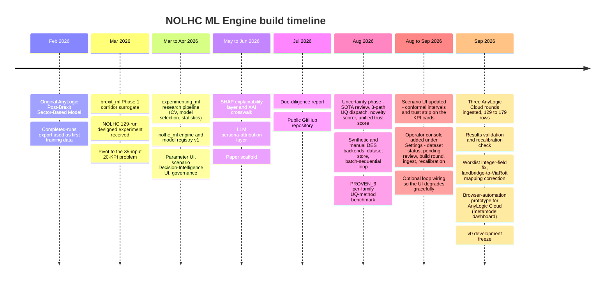
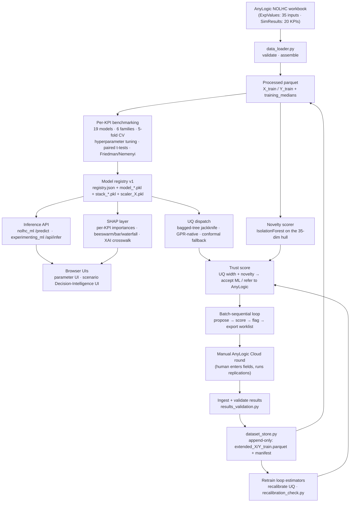
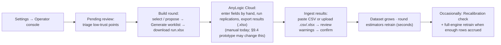

# NOLHC ML Engine — Technical Report & Handover Manual

**Project:** Machine Learning and Simulation Frameworks for Border-Control Capacity Assessment — Post-Brexit Ireland–GB–EU Agri-Food Logistics
**Document type:** Technical report and maintenance manual for the client
**Prepared for:** Dr Amr Mahfouz
**Repository:** <https://github.com/nilashree28-wq/NOLHC-ML-Engine>
**Covers:** February 2026 – September 2026, the complete delivery (`nolhc_ml`, `experimenting_ml`, and the superseded `brexit_ml`)
**Status:** v1.0 — 6 September 2026

---

## Table of contents

1. [About this document](#1-about-this-document)
2. [Project history (February–September 2026)](#2-project-history-februaryseptember-2026)
3. [What was delivered — system overview](#3-what-was-delivered--system-overview)
4. [Repository map — navigating the folder structure](#4-repository-map--navigating-the-folder-structure)
5. [Environment and Python libraries](#5-environment-and-python-libraries)
6. [The dataset — where it lives and where to add data](#6-the-dataset--where-it-lives-and-where-to-add-data)
7. [How the ML engine is built](#7-how-the-ml-engine-is-built)
8. [The uncertainty and self-extension layer](#8-the-uncertainty-and-self-extension-layer)
9. [Running a manual AnyLogic round](#9-running-a-manual-anylogic-round)
10. [Reproducing the results](#10-reproducing-the-results)
11. [Launching the user interfaces from the terminal](#11-launching-the-user-interfaces-from-the-terminal)
12. [Extending the model for new inputs and new KPIs](#12-extending-the-model-for-new-inputs-and-new-kpis)
13. [Operator console for dataset growth and uncertainty monitoring](#13-operator-console-for-dataset-growth-and-uncertainty-monitoring)
14. [Testing and quality assurance](#14-testing-and-quality-assurance)
15. [Experimental results, limitations and future scope](#15-experimental-results-limitations-and-future-scope)
16. [Recommended next steps](#16-recommended-next-steps)
17. [Appendices](#17-appendices)

---

## 1. About this document

### 1.1 Purpose

This is the **technical handover** for the NOLHC ML Engine. It is written for two readers:

- **The client sponsor**, who needs to understand what was built, what it does, and what it is worth as an asset.
- **An analyst or engineer inheriting the project**, who needs to run it, reproduce its results, operate the dataset-growth loop, and extend it for future case studies.

It is deliberately **reproducibility-first**: each step tells you *what to run* and *what kind of artifact comes out*, not what the numbers were. The substantive results, evaluation and business recommendations are reported in the separate **Business Consulting Project (BCP) report**; this document is the operating manual that sits underneath it.

### 1.2 Relationship to other documents

| Document | Role |
|---|---|
| **This report** | Authoritative operating and handover manual. **Supersedes** the July 2026 due-diligence report. |
| `docs/NOLHC_ML_Engine_Due_Diligence_Report.md` | Earlier (July 2026) diligence note covering `nolhc_ml` + SHAP only, before the uncertainty layer. Retained for history; superseded by this document. |
| `REPRODUCE.md` (repo root) | The condensed "clean clone → running system" checklist. Section 10 of this report is its long form. |
| `experimenting_ml/docs/spec.md` | The detailed engineering spec and open-questions log for the uncertainty / self-extension phase. Referenced throughout Section 8. |
| `experimenting_ml/docs/ML_Pipeline_Specification.md` | The step-by-step spec for the benchmarking pipeline. Referenced in Section 7. |
| **BCP report** (separate) | The graded consulting deliverable: findings, analysis, discussion, recommendations, business case. |

### 1.3 How to use it

- New to the project? Read Sections 2–4, then follow Section 10 on a clean clone.
- Need to demo it? Section 11.
- Running the twice-weekly dataset-growth cycle? Section 9, then Section 13 for the operator console that replaces the command line.
- Planning a new case study with extra parameters or KPIs? Section 12.

---

## 2. Project history (February–September 2026)

The repository contains three code bases because the work went through three phases. Understanding the sequence explains why the folder structure looks the way it does.



### 2.1 Phase 1 — `brexit_ml` (superseded)

The first surrogate, `brexit_ml/`, modelled the Ireland ↔ Great Britain East/West corridor. It was trained on the **completed-runs export of the earlier *Post-Brexit Sector-Based Model*** (`brexit_ml/data/raw/Post-Brexit Sector Based Model - PostBrexit_Model_ML Meta Model - Completed runs-2.xlsx`), using XGBoost regressors behind a FastAPI service and a browser UI.

**Why it was superseded.** That completed-runs set was an ad-hoc accumulation of simulation runs, not a designed experiment: it suffered zero-inflation in several outputs and had no orthogonality guarantees between inputs, which limited how well any surrogate could generalise. When the **129-run Nearly-Orthogonal Latin Hypercube (NOLHC) design** became available in late March — a structured sweep of 35 continuous inputs with column correlations held roughly within ±0.3 — all engine work moved to it. `brexit_ml` is kept in the repository for context and traceability only; it is **not part of the reproducible deliverable** (see Section 15).

### 2.2 Phase 2 — the NOLHC engine, UI and explainability

Two code bases were built against the NOLHC design:

- **`nolhc_ml/`** — a production-style engine. For each of the 20 KPIs it benchmarks 19 candidate models across 6 families, optionally builds a stacking ensemble, and registers the winner in `models/v1/registry.json`. A FastAPI service serves millisecond predictions to a browser parameter UI.
- **`experimenting_ml/`** — the research pipeline that produced the evidence behind those choices: repeated cross-validation, hyperparameter tuning, paired statistical tests, learning curves, residual diagnostics, SHAP explainability, and split-conformal prediction intervals. It also carries a second, scenario-oriented **Decision-Intelligence UI** with a parameter-governance layer.

### 2.3 Phase 3 — uncertainty and self-extension

The engine could predict fast but could not say **when to trust a prediction**, could not detect when a live scenario was **unlike anything in the 129 training runs**, and had **no mechanism to grow**. Phase 3 (August–September) closed those three gaps:

- a uniform **uncertainty-quantification (UQ)** layer with three dispatch paths (bagged-tree jackknife, Gaussian-process native variance, split-conformal fallback), routed automatically by the registry;
- a **novelty / out-of-distribution scorer** on the 35-dimensional input hull;
- a single **trust score** combining UQ width and novelty, with a per-KPI "accept the ML prediction / refer to AnyLogic" decision;
- a **batch-sequential loop**: propose candidate scenarios → score them → flag the untrustworthy ones → export a worklist → run them in AnyLogic → ingest the results → append to the training set → retrain → recalibrate;
- **PROVEN_6**, a per-model-family benchmark that fixes one UQ method per family with empirical evidence;
- **the scenario UI updated** (August–September) so the reliability signal is visible where decisions are made: conformal intervals and a trust strip on the KPI cards, and an **operator console** under Settings that runs the dataset-growth loop as a screen (Section 13). The additions are purely additive — the existing screening flow, governance layer and endpoints are untouched.

By the 6 September freeze, **three AnyLogic Cloud rounds** had been ingested, growing the training set from **129 to 179 rows** on the record. (One caveat surfaced late and is disclosed in Section 15.2: the AnyLogic Cloud *dashboard* route used for the September rounds runs a trained meta-model of the simulation, not the full discrete-event model — whether meta-model-sourced points belong in this project's own surrogate training set is an open question for the mentor.)

---

## 3. What was delivered — system overview

### 3.1 The three code bases

| Path | What it is | Status |
|---|---|---|
| `nolhc_ml/` | Production-style surrogate engine: per-KPI model registry (`v1`), FastAPI inference API (`/predict`), parameter UI | **Authoritative engine** |
| `experimenting_ml/` | Research pipeline (CV, model selection, statistics, SHAP, conformal) + the uncertainty / novelty / self-extension loop + scenario Decision-Intelligence UI | **Authoritative research and reliability layer** |
| `brexit_ml/` | Phase 1 Ireland–GB corridor surrogate | **Superseded** — context only |

The uncertainty loop in `experimenting_ml/src/loop/` reads the trained engine from `nolhc_ml/models/v1/` and the dataset from `nolhc_ml/data/`. This cross-package dependency is intentional and resolved by path in the code.

### 3.2 The problem being solved

The AnyLogic discrete-event simulation of post-Brexit RoRo freight can answer route, staffing and border-policy questions, but it is heavy: many parameters, long run times, and an AnyLogic Cloud API subscription of **€2,520 per year** to run it programmatically. That makes interactive scenario exploration in a meeting impractical.

The surrogate replaces the simulation for **early scenario screening**: from **35 continuous inputs** it predicts **20 operational KPIs** (transit times, waiting times, staff utilisations) in milliseconds, in a browser, with SHAP explanations and — after Phase 3 — an explicit trust signal telling the user when to fall back to the real simulation.

### 3.3 Runtime architecture



Items A–H are the Phase 2 platform; items I–P are the Phase 3 reliability and growth layer. Everything to the right of the registry is additive — it does not change how the engine predicts, only how much you can rely on the prediction and how the evidence base grows.

---

## 4. Repository map — navigating the folder structure

### 4.1 Top level

```
NOLHC-ML-Engine/
├── nolhc_ml/            # Authoritative engine — registry v1, FastAPI, parameter UI
├── experimenting_ml/    # Research pipeline + uncertainty loop + scenario UI
├── brexit_ml/           # Phase 1 (superseded — context only)
├── docs/                # Engineering specs, figures, this report, due-diligence report
├── REPRODUCE.md         # Clean-clone → running-system checklist
└── .gitignore
```

Each code base is **self-contained**: its own `src/`, `data/`, `models/` or `outputs/`, `tests/`, `requirements.txt` and `requirements.lock.txt`, and its own virtual environment.

### 4.2 `nolhc_ml/`

```
nolhc_ml/
├── main.py                     # uvicorn entrypoint — serves API + parameter UI
├── requirements.txt            # loose ranges
├── requirements.lock.txt       # exact pins (use this)
├── src/
│   ├── data_loader.py          # xlsx → validated X/Y parquet
│   ├── training_columns.py     # THE column contract: 35 input names, 20 KPI names, order
│   ├── candidate_models.py     # the 19 candidate models across 6 families
│   ├── train.py                # per-KPI benchmark + stacking + register → models/v1/
│   ├── evaluate.py             # hold-out metrics + interval half-widths
│   ├── evaluate_to_excel.py    # evaluation workbook
│   ├── ml_engine.py            # loads registry, runs prediction
│   ├── ml_api.py               # FastAPI routes: /predict /health /outputs /inputs /benchmark
│   └── schemas.py              # request/response models
├── data/
│   ├── raw/
│   │   ├── nolhc_runs.xlsx            # THE source workbook (tracked)
│   │   ├── anylogic_manual_constants.json   # the 89 confirmed-constant AnyLogic fields
│   │   └── anylogic_complete_parameters.json
│   └── processed/
│       ├── X_train.parquet · Y_train.parquet   # 129×35 / 129×20 (tracked)
│       └── training_medians.json
├── models/v1/                  # TRACKED — registry.json, 20 model_*.pkl, 20 stack_*.pkl,
│                               #   scaler_X.pkl, 20 benchmark_*.json, residuals/, plots/
├── ui/                         # parameter UI (index.html, app.js, components/, data/, styles/)
└── tests/                      # test_api.py, test_data_loader.py, test_train.py
```

### 4.3 `experimenting_ml/`

```
experimenting_ml/
├── requirements.txt / requirements.lock.txt
├── pytest.ini                  # scopes `pytest` to tests/ (ignores the legacy src/test_eval.py)
├── run_step1_cv.py             # ordered pipeline runners (see §7 and §10)
├── run_mentor_step2.py
├── run_step3_pre_conformal.py
├── run_step4_shap.py  / run_step4_shap_master_excel.py
├── run_step6_retrain.py
├── run_test_set_evaluation_final.py
├── run_step10_report.py
├── run_ui_inference_api.py     # serves the scenario Decision-Intelligence UI + /api/infer
├── src/
│   ├── data.py · splits.py · models.py · cross_validation.py
│   ├── paired_ttests.py · step2_*.py · step3_*.py       # stats, ranking, CD diagrams, learning curves
│   ├── step4_shap.py · shap_crosswalk_report.py         # SHAP layer
│   ├── conformal_predict.py                             # split-conformal intervals
│   ├── retrain.py
│   ├── nolhc_input_metadata.py · scenario_dynamic_params.py   # UI slider bounds + governance
│   ├── llm_attribution/        # LLM persona-attribution layer (schema, personas, prompting, golden)
│   └── loop/                   # ── PHASE 3 ──
│       ├── loop.py             # orchestrator: fit_kpi_estimators, compute_trust_scores,
│       │                       #   calibrate, propose_and_flag, run_loop,
│       │                       #   export_manual_round, ingest_manual_round
│       ├── trust.py            # UQ + novelty → per-KPI threshold → decide()
│       ├── novelty.py          # IsolationForest OOD scorer on the 35-dim hull
│       ├── kpi_scope.py        # DEMO_4 / PROVEN_6 / all20 scoping
│       ├── proven6.py          # per-family UQ-method winners (see reports/)
│       ├── dataset_store.py    # append-only training-set growth + rounds manifest
│       ├── results_validation.py       # sanity warnings on ingested AnyLogic results
│       ├── recalibration_check.py      # is each PROVEN_6 method still best on the grown data?
│       ├── cli_export_manual_round.py  # ── the reproducible triggers ──
│       ├── cli_ingest_manual_round.py
│       ├── cli_recalibrate_uq_methods.py
│       ├── uq/                 # dispatch.py + tree_native, gpr_native, conformal_fallback, mapie_cv_plus
│       └── des_backend/        # synthetic.py, ground_truth_gp.py, demo4_ground_truth.py,
│                               #   manual_worklist.py (+ ground_truth_gps.joblib)
│                               #   [prototype, not committed] cloud_api.py — AnyLogic Cloud browser driver (§9.4)
├── data/manual_rounds/        # round_<ts>/ (run.csv, run.xlsx, results.csv) +
│                              #   extended_X/Y_train.parquet + rounds_manifest.json
├── docs/
│   ├── spec.md                        # the Phase 3 engineering spec + open-questions log
│   ├── ML_Pipeline_Specification.md   # the benchmarking pipeline spec
│   ├── Mentor_UI_Parameter_Governance_Spec.md
│   ├── Experimental_Analysis_Report_Mentor.md
│   ├── CV_Best_Models_Per_Target.md
│   └── anylogic/                      # the AnyLogic worksheet reference workbooks (see §9)
├── reports/                   # UQ_Method_Benchmark.xlsx, PROVEN_6_Trust_Report.xlsx,
│                              #   UQ_Prediction_Report.xlsx + README.md
├── outputs/                   # committed pipeline artifacts (CV JSON, SHAP masters,
│                              #   pipeline_results.xlsx, step2/ step3/ plots)
└── UI/                        # scenario Decision-Intelligence UI + settings.html
```

### 4.4 `docs/`

Engineering specs (`ml/spec/`, `ui/`, `api/`), `figures/`, the input/output crosswalk CSVs, `NOLHC_ML_Engine_Due_Diligence_Report.md`, and this report. Signed / personal / third-party-copyright material, the BCP academic-process working folder, and the student-submission material (presentations, the research-paper drafts, group coursework reports) are **kept local and are not in the repository** (see `docs/.gitignore`).

### 4.5 What is *not* here (and why)

| Removed 5 Sep 2026 | Reason |
|---|---|
| `submission_package/`, `submission_package_mentor/` (and `" 2"` copies) | Stale July-era duplicate copies of all three code bases (2,535 files). Retained in git history; archived off-repo. |
| `*.zip` handoff archives, `Submission_Package_Group 18/` | Duplicate bundles. |
| all `.venv/`, `__pycache__/`, `.pytest_cache/`, `catboost_info/` | Regenerable. `catboost_info/` is CatBoost training telemetry written to the working directory. |
| `~$*` Office lock files, `.DS_Store`, `.pydeps/`, `.tmp_pypdf/` | Editor / OS scratch. |

If you are looking at an older clone or archive and see these, ignore them.

---

## 5. Environment and Python libraries

### 5.1 One interpreter

**Python 3.8.10** runs all three code bases. (Earlier notes said `nolhc_ml` needed 3.10+; that is not the case — it installs and tests clean on 3.8.10.)

### 5.2 Setup, per code base

Each code base gets its own virtual environment built from its own lock file.

**macOS / Linux (bash / zsh):**

```bash
cd nolhc_ml               # then experimenting_ml, then (optionally) brexit_ml
python3.8 -m venv .venv
./.venv/bin/pip install -r requirements.lock.txt
```

**Windows (PowerShell):**

```powershell
cd nolhc_ml               # then experimenting_ml, then (optionally) brexit_ml
py -3.8 -m venv .venv     # or: python -m venv .venv   (if 3.8 is the only Python)
.venv\Scripts\pip install -r requirements.lock.txt
```

`requirements.txt` holds human-readable version ranges; **`requirements.lock.txt` holds the exact pins captured on 5 September 2026 and is what you should install for reproduction.**

### 5.2.1 Command convention used in this document

The command blocks that follow are written for **macOS / Linux**. To run them on **Windows PowerShell**, apply these substitutions (a virtual environment must be activated or the interpreter called by full path either way):

| macOS / Linux | Windows PowerShell |
|---|---|
| `python3.8 -m venv .venv` | `py -3.8 -m venv .venv` |
| `./.venv/bin/python …` | `.venv\Scripts\python …` |
| `./.venv/bin/pip …` | `.venv\Scripts\pip …` |
| `./.venv/bin/python -m pytest -q` | `.venv\Scripts\python -m pytest -q` |
| `cmd_a && cmd_b` (chain) | run on two lines, or `cmd_a; if ($?) { cmd_b }` |
| `~/Downloads/file.csv` | `$env:USERPROFILE\Downloads\file.csv` |
| `for pkg in a b c; do … done` | `foreach ($pkg in 'a','b','c') { … }` |

Alternatively, **activate** the environment once per shell (`.venv\Scripts\Activate.ps1` on Windows, `source .venv/bin/activate` on macOS/Linux) and then just call `python` / `pip` / `pytest` directly. If PowerShell blocks the activation script, run `Set-ExecutionPolicy -Scope CurrentUser RemoteSigned` once. On Apple Silicon, `brew install libomp` if XGBoost fails to import.

### 5.3 Key libraries and where they are used

| Library | Pinned | Used for |
|---|---|---|
| `scikit-learn` | 1.3.2 | Gaussian-process, tree-ensemble, SVR, linear and MLP regressors; CV; `StandardScaler`; `IsolationForest`; `StackingRegressor` |
| `numpy` / `scipy` | 1.24.4 / 1.10.1 | numerics; `scipy.stats.ttest_rel` for paired t-tests |
| `xgboost` / `lightgbm` / `catboost` | 2.1.4 / 4.6.0 / 1.2.10 | gradient-boosting candidate models |
| `scikit-posthocs` | 0.7+ | Friedman / Nemenyi post-hoc tests, critical-difference diagrams |
| `shap` | 0.44.1 | explainability layer (`TreeExplainer` and generic explainer) |
| `mapie` | 0.9.2 (`<1.0`) | jackknife+ / CV+ conformal intervals for the PROVEN_6 benchmark |
| `pandas` / `pyarrow` / `openpyxl` | 2.0.3 / — / — | data frames; parquet; Excel read/write |
| `matplotlib` | 3.6+ | residual plots, learning curves, calibration curves, CD diagrams |
| `fastapi` / `uvicorn` / `pydantic` | 0.124.4 / — / 2.10.6 | the `nolhc_ml` inference service (`experimenting_ml` uses the standard-library HTTP server) |
| `joblib` | 1.2+ | model persistence (`.pkl`, `.joblib`) |

### 5.4 Recommendation

Add a lockfile-based container image (`Dockerfile` pinning Python 3.8.10 + the three lock files) before wider distribution, so the environment cannot drift. The lock files are the minimum; a container makes reproduction turn-key.

---

## 6. The dataset — where it lives and where to add data

### 6.1 The three forms of the data

| Form | Path | Notes |
|---|---|---|
| **Source workbook** (immutable) | `nolhc_ml/data/raw/nolhc_runs.xlsx` | Sheets `ExpValues` (35 inputs) and `SimResults` (20 KPIs), each with three header rows; data from row 4. Tracked. |
| **Processed matrices** | `nolhc_ml/data/processed/X_train.parquet`, `Y_train.parquet` | 129×35 and 129×20. Regenerated by `data_loader.py`. Tracked. |
| **Grown training set** | `experimenting_ml/data/manual_rounds/extended_X_train.parquet`, `extended_Y_train.parquet` | Rows added by real AnyLogic rounds (40 rows as of the freeze). The original 129 are **never modified**. |

`experimenting_ml/src/loop/dataset_store.py::load_current_training_data()` transparently returns **the original 129 plus every ingested round**, so nothing downstream needs to know how many rounds have happened.

### 6.2 The column contract

`nolhc_ml/src/training_columns.py` is the single source of truth for the 35 input names, the 20 KPI names, and their order. `data_loader.py` reads the workbook against it. **Any change to inputs or KPIs starts here** (see Section 12).

### 6.3 Where to put new data

- **A full re-designed NOLHC batch** (e.g. a new 150-run design) → replace `nolhc_ml/data/raw/nolhc_runs.xlsx`, re-run the pipeline, and register the result as a new model version (`models/v2/`). The old version stays intact.
- **Incremental rows from a manual AnyLogic round** → use the ingest CLI (Section 9). Rows are appended to `extended_*.parquet` and logged in `rounds_manifest.json`. This is the normal, twice-weekly path.
- **To start over from a clean slate** (e.g. before a fresh demo): delete `experimenting_ml/data/manual_rounds/`. The original 129 in `nolhc_ml/data/processed/` are untouched, so nothing is lost.

---

## 7. How the ML engine is built

Each stage below lists the file(s), the command, and the kind of artifact it produces. Full detail is in `experimenting_ml/docs/ML_Pipeline_Specification.md`.

### 7.1 Data load and split

- **Files:** `nolhc_ml/src/data_loader.py`, `experimenting_ml/src/splits.py`
- **What happens:** the workbook is validated (129 rows, no NaN) and written to parquet. A strict **80/20 split (103 train / 26 test), random seed 42**, is fixed and recorded; the 26-row test set is never touched during training, CV or hyperparameter search. `StandardScaler` is fit **inside each CV fold** on the fold-train rows only; tree models use unscaled inputs.

### 7.2 Hyperparameter tuning

- **Files:** `experimenting_ml/run_step1_cv.py`, `src/cross_validation.py`, `src/step2_cv_config.py`, `src/models.py`
- **Command:** `python run_step1_cv.py`
- **What happens:** for each of the 20 KPIs and each of the 19 candidate models, every hyperparameter combination in the model's grid is evaluated by **5-fold cross-validation on the training set only**. The best combination is the one with the lowest mean CV RMSE, ties broken by lowest standard deviation across folds. The five per-fold RMSEs for the winning configuration are retained for the statistical tests.
- **Produces:** `outputs/cv_results.json`, `outputs/cv_best_hyperparameters_long.csv` (380 rows: every KPI × model), and the readable summary `experimenting_ml/docs/CV_Best_Models_Per_Target.md`.
- **The candidate set** (`nolhc_ml/src/candidate_models.py`) spans **6 families**: Gaussian processes (RBF, Matérn), tree ensembles (Random Forest, Extra Trees, Gradient Boosting, XGBoost, LightGBM, CatBoost, AdaBoost), support-vector regression (RBF, polynomial), penalised linear (Ridge, Lasso, ElasticNet, Bayesian Ridge), polynomial regression, and instance-based / neural (KNN, MLP).

### 7.3 Model selection

- **Files:** `experimenting_ml/src/step3_selection.py`, `src/paired_ttests.py`, `src/step2_ranking.py`, `src/step2_cd_plot.py`, `src/step2_residuals.py`, `src/step2_learning_curves.py`
- **Commands:** `python run_mentor_step2.py` then `python run_step3_pre_conformal.py`
- **What happens:** models are compared per KPI on a **composite score** — 40% CV stability (mean + std of CV RMSE), 40% hold-out performance (RMSE / MAE / R²), 20% count of statistically significant pairwise wins. Significance comes from **171 paired t-tests per KPI** on the CV fold RMSEs, backed by **Friedman + Nemenyi** post-hoc tests and **critical-difference diagrams**. Learning curves and residual diagnostics are generated for the shortlist. In `nolhc_ml`, a **stacking ensemble** of the top base learners is also fitted and registered instead of the single model where it wins.
- **Produces:** `outputs/pipeline_results.xlsx`, `outputs/model_stability_by_target.xlsx`, `outputs/step2/` (CD diagrams, learning curves, residual plots), `outputs/step3/` (calibration curves, hyperparameter-sensitivity plots).
- **The authoritative record** of what was chosen per KPI is `nolhc_ml/models/v1/registry.json` — its `registered_as` field for each KPI. Stacking won 8 of 20 KPIs; the mean CV R² across all 20 is 0.74.

### 7.4 SHAP explainability

- **Files:** `experimenting_ml/src/step4_shap.py`, `src/shap_crosswalk_report.py`, `src/step4_shap_master_excel.py`
- **Commands:** `python run_step4_shap.py` then `python run_step4_shap_master_excel.py`
- **What happens:** SHAP values are computed for the selected model per KPI — `TreeExplainer` where the model is a tree ensemble, the generic explainer otherwise. Per-KPI feature-importance tables and standard plot types (beeswarm, bar, waterfall) are produced. `docs/NOLHC_XAI_crosswalk.md` maps the coded input names to plain-language SIG groups so a domain reviewer can mark each driver **expected / surprising / red-flag** before any stakeholder-facing text is written.
- **Produces:** `outputs/shap_master.xlsx`, per-KPI importance CSVs, plot files, and `outputs/step4_shap/xai_review/`.
- **Optional LLM layer:** `experimenting_ml/src/llm_attribution/` consumes the structured SHAP summaries (not raw model access) through a fixed persona/prompt schema to draft narrative attributions. It needs an LLM API key and is non-deterministic; a "golden" snapshot is included for offline use.

### 7.5 Split-conformal prediction intervals (baseline UQ)

- **File:** `experimenting_ml/src/conformal_predict.py`
- **What happens:** for each KPI, an inductive split-conformal interval is calibrated from the hold-out residuals with an adaptive coverage level (0.90 / 0.95 / 0.99 depending on how close the model's RMSE is to the best model for that KPI). These intervals are computed and returned by the inference API, and the simulator now draws them on the KPI cards (Section 13).
- **Produces:** `outputs/conformal_results.json` / `.csv`.

### 7.6 Retrain and hold-out evaluation

- **Commands:** `python run_step6_retrain.py`, `python run_test_set_evaluation_final.py`, `python run_step7_9_evaluate.py`
- **Produces:** fitted models on the full training set, the final hold-out metric tables, and the narrative test-set workbook.

### 7.7 Regenerating the registered engine

```bash
cd nolhc_ml
./.venv/bin/python src/train.py            # data/raw/nolhc_runs.xlsx → models/v1/
./.venv/bin/python src/evaluate.py
./.venv/bin/python src/evaluate_to_excel.py
```

```powershell
# Windows PowerShell — replace ./.venv/bin/ with .venv\Scripts\
cd nolhc_ml
.venv\Scripts\python src\train.py
.venv\Scripts\python src\evaluate.py
.venv\Scripts\python src\evaluate_to_excel.py
```

`train.py` is deterministic (seed 42). Verified on 5 September 2026 against the committed lock file: a full re-run reproduced **all 20/20 per-KPI winners**, the mean R² (0.7357) and the stacking-won count (8) exactly — gradient-boosting models included. Off the pinned versions, expect boosting metrics to drift within library-version tolerance.

---

## 8. The uncertainty and self-extension layer

All of this lives in `experimenting_ml/src/loop/`. The engineering spec and the full open-questions log are in `experimenting_ml/docs/spec.md`.

### 8.1 UQ dispatch — three paths, routed automatically

A prediction's uncertainty is estimated by one of three mechanisms, chosen by the KPI's `registered_as` family in `registry.json` — never hard-coded:

| Path | Families | Mechanism | File |
|---|---|---|---|
| Bagged-tree native | Random Forest, Extra Trees | Infinitesimal-jackknife / bagging variance across the trees | `uq/tree_native.py` |
| GPR native | Gaussian process (RBF, Matérn) | Posterior standard deviation (`return_std=True`) | `uq/gpr_native.py` |
| Conformal fallback | Boosting, SVR, linear, polynomial, KNN, MLP, stacking | Split-conformal interval on residuals | `uq/conformal_fallback.py` |

The generic dispatcher (`uq/dispatch.py`) takes a list of KPI slugs and routes each one. All three paths emit the same normalised interval shape, so the loop's threshold logic does not care which produced it.

### 8.2 Novelty / out-of-distribution scoring

`loop/novelty.py` fits an `IsolationForest` on the 35-dimensional training hull and scores how unlike the training data a new input vector is. A documented finding (spec.md §7 item 7): at 35 dimensions the scorer **does not react to a single extreme input** — one outlier dimension is diluted across 34 ordinary ones — but **does react to genuine multi-dimensional excursions**. This is a structural property of the method at this dimensionality and is reported, not worked around.

### 8.3 The trust score

`loop/trust.py` combines the normalised UQ interval width and the novelty score into a single per-prediction trust score, compares it to a **per-KPI threshold** (calibrated as that KPI's 90th percentile of trust scores on the training data), and returns a decision: **accept the ML prediction**, or **refer this scenario to AnyLogic**.

### 8.4 PROVEN_6 — one UQ method fixed per model family

`reports/UQ_Method_Benchmark.xlsx` records a benchmark of three candidate UQ methods across six model families (Gaussian process, Extra Trees, ElasticNet, Lasso, SVR, Gradient Boosting) on held-out data, with 95% Wilson-score confidence intervals on every coverage number. One method is fixed per family with evidence; the winners are enforced in `loop/proven6.py` and tested in `tests/test_proven6.py`. A cross-cutting finding: a hand-rolled bootstrap-ensemble method lost in every family, badly overconfident throughout.

**Reproducibility note.** The script that *ran* that selection benchmark was never committed; the workbook is retained as evidence and the *decisions* it produced are enforced and tested in code. `experimenting_ml/reports/README.md` documents exactly which parts are test-covered and which are result-only. The lighter `recalibration_check.py` (below) *is* committed and tested.

### 8.5 DES backends

| Backend | Use | File |
|---|---|---|
| `SyntheticDESBackend` | Fast, offline. A Gaussian-process (for GP-won KPIs) or the trained production model (for the rest) stands in as ground truth, with injected replication noise. For iterating on loop mechanics. | `des_backend/synthetic.py`, `ground_truth_gp.py`, `demo4_ground_truth.py` |
| `ManualWorklistDESBackend` | The real path. Generates a human-followable worklist (35 varying values + 89 constants per candidate) and ingests the AnyLogic results file back. | `des_backend/manual_worklist.py` |
| *(prototype)* `CloudApiDESBackend` | **§9.4 — working prototype, not committed.** A Playwright script drives the AnyLogic Cloud dashboard from a worklist, no by-hand entry. Caveat: the dashboard runs a *meta-model*, not the DES, and only 4 KPIs come back cleanly. | *(prototype)* `des_backend/cloud_api.py` |

The replication **count** for the original 129 runs is confirmed (5 per point); the replication **noise magnitude** is a documented placeholder (`0.15 × CV-RMSE`), because the per-replication values behind the 129 means were not retained. The September growth rounds entered through the AnyLogic Cloud dashboard came back with **`seed = 1`, a single replication** (spec.md §7 item 22) — a further reason the meta-model-sourcing question in Section 15.2 needs resolving before those rows carry weight.

`manual_worklist.py` writes the worklist with AnyLogic's own field types respected: **27 of the 35 factors are Integer-typed** in AnyLogic Cloud (volumes, staff counts, vessel capacities, check-time minutes) and are rounded to whole numbers; only the 8 percentage / fraction factors keep a decimal value. Before this fix (spec.md §7 item 20) every factor was written as a raw float, which AnyLogic's manual-entry form rejects outright.

### 8.6 The batch-sequential loop

`loop/loop.py` orchestrates: `propose_and_flag` → `export_manual_round` → (manual AnyLogic) → `ingest_manual_round` → append via `dataset_store` → retrain the round's estimators → recalibrate. `kpi_scope.py` defines three scopes:

- **DEMO_4** — one KPI per dispatch path plus a known-bad stress test (`tt_ib_dr`, R² ≈ −0.12); the depth-validated set.
- **PROVEN_6** — the six KPIs with a benchmarked per-family UQ method.
- **all20** — every registered KPI, routed generically.

### 8.7 Results validation and recalibration (September additions)

- `results_validation.py` — before an ingest is trusted, warns (non-blocking) about KPI columns where every new value is identical, or values far outside the historical range. Built after a real incident where four KPIs read exactly 0.000 across a whole batch.
- `recalibration_check.py` / `cli_recalibrate_uq_methods.py` — re-runs each PROVEN_6 KPI's family comparison against the current (grown) training set and flags `REVIEW NEEDED` where the closest-to-target method now differs from the fixed one. **Read-only** — it never edits `proven6.py`; a changed winner is surfaced for the same mentor sign-off the original choice went through. On the current grown dataset, only `tt_ob_lb` currently flags.

### 8.8 State at the freeze

Three AnyLogic Cloud rounds ingested → **179 training rows** (129 + 10 + 30 + 10). The third (`round_20260906_090349`, all20) came in through the browser-automation prototype (§9.4) and populated only 4 of the 20 KPIs — the four resource-utilisation scalars (`Uti_Cus_D/R`, `Uti_DAFM_D/R`) — the rest of that route's output is not yet mappable (§9.4). Two rounds remain exported and pending: `round_20260829_181116` (PROVEN_6) and `round_20260906_103618` (DEMO_4). Growth is **very uneven per KPI** because whole columns were excluded from rounds for unresolved data-quality reasons (Section 15.3).

---

## 9. Running a manual AnyLogic round

This is the twice-weekly cycle that grows the dataset. The command sequence is the reproducible runbook from `experimenting_ml/docs/spec.md` §8.

### 9.1 The commands

```bash
cd experimenting_ml/src

# 1. Propose candidates, score them, flag a batch, export the worklist.
python -m loop.cli_export_manual_round \
    --kpi-scope demo4 \
    --n-candidates 20 \
    --quantile 0.9 \
    --max-batch-size 10 \
    --n-replications 5 \
    --seed 42
#  → prints a round id, e.g. round_20260906_101500, and writes:
#     experimenting_ml/data/manual_rounds/round_20260906_101500/run.csv   (canonical request record)
#     experimenting_ml/data/manual_rounds/round_20260906_101500/run.xlsx  (human worksheet, incl. the 89 constants)

# 2. MANUAL STEP — see §9.2.

# 3. Ingest the real results, retrain, persist, log.
python -m loop.cli_ingest_manual_round \
    --round-id round_20260906_101500 \
    --results ~/Downloads/anylogic_results.csv
#  → validates the results (non-blocking warnings), retrains the round's
#    estimators on the grown data, appends every KPI column the results file
#    had to extended_{X,Y}_train.parquet, flips the manifest entry to "ingested".
```

On **Windows PowerShell**, put each command on one line (drop the `\` continuations) and use a Windows path for the results file:

```powershell
cd experimenting_ml\src
.venv\Scripts\python -m loop.cli_export_manual_round --kpi-scope demo4 --n-candidates 20 --quantile 0.9 --max-batch-size 10 --n-replications 5 --seed 42
# ... manual AnyLogic step ...
.venv\Scripts\python -m loop.cli_ingest_manual_round --round-id round_20260906_101500 --results $env:USERPROFILE\Downloads\anylogic_results.csv
```

(The `.venv` here is `experimenting_ml/.venv`; call it by the path shown or activate it first.)

Use `--kpi-scope proven6` to run against the PROVEN_6 benchmarked methods instead of the generic dispatch. Repeating steps 1–3 automatically works against the grown dataset.

### 9.2 The manual AnyLogic step — you build the worksheet

**AnyLogic Cloud has no bulk import — every field is entered by hand** (unless the browser-automation prototype in §9.4 applies). The `run.xlsx` the export step produces is your worksheet: one row per requested run, the 35 varying parameter values (headed by their AnyLogic field name where one exists), the 89 confirmed constants for reference, and the replication count and seed.

Two corrections landed on 6 September (spec.md §7 items 20 and 23) and are baked into the generator:

- **Integer fields.** 27 of the 35 factors are Integer-typed in AnyLogic Cloud; the worksheet now rounds them to whole numbers. Only the 8 percentage / fraction factors carry a decimal. Older worksheets wrote raw floats, which AnyLogic's entry form rejects.
- **Four factors were mis-labelled "no AnyLogic field".** `NA_Im_LB`, `NA_Ex_LB`, `A_Im_LB`, `A_Ex_LB` in fact map to the Rotterdam-direct volume fields `VolAllPImViaRott` / `VolAllPExViaRott` / `VolAgriImViaRott` / `VolAgriExViaRott` — confirmed against the live dashboard. Only **3 factors** genuinely have no AnyLogic field now: `Pct_NA_OB_Green`, `Pct_NA_OB_Red`, `Pct_A_OB_Red`. Rounds entered by hand before this date skipped those four — see Section 15.3.

For a fresh case study, or to cross-check the generated sheet, use the reference workbooks in **`experimenting_ml/docs/anylogic/`**:

| Workbook | What it gives you |
|---|---|
| `NOLHC Designs - AL Students Recent 26.xlsx` | the 129-run designed experiment — the format your `ExpValues` / `SimResults` sheets must match |
| `Model List of input and output parameters - recent 26.xlsx` | the 35 inputs and 20 KPIs with descriptions and units |
| `AnyLogic_Constants_Worklist.xlsx` | the 89 confirmed-constant AnyLogic fields, the 35 varying ones, and the 3 factors that have **no** AnyLogic field (leave blank) — was 7 until the 6-Sep ViaRott correction |
| `AnyLogic_Run_Requests_DEMO.csv`, `AnyLogic_Manual_Worklist_DEMO.xlsx`, `NOLHC Designs - AL Students Manual Run.xlsx` | worked examples of a completed run worksheet |

**Procedure:** open `run.xlsx` (cross-referenced against `AnyLogic_Constants_Worklist.xlsx`), enter every field for each run into AnyLogic Cloud, run each request's replications, and export the results as CSV with one row per replication: `run_id, replication, seed, <one column per KPI AnyLogic produced>`.

### 9.3 What ingest does

- **Validates** the results (`results_validation.py`) and prints any warnings.
- **Appends** every KPI column present — not just the round's focus KPIs — to `extended_{X,Y}_train.parquet`. Rows with a missing value for a given KPI are dropped **per KPI** when that KPI's estimator is retrained, so one KPI's gap does not block the others.
- **Retrains** the round's estimators and **updates** `rounds_manifest.json` (status → `ingested`, row count, timestamps).
- The full `nolhc_ml` engine is **not** retrained automatically (that is a ~20–40-minute job) — do it deliberately when enough rows have accumulated.

### 9.4 Browser-automation for AnyLogic Cloud (prototype — not yet in the repository)

> **Status: a working prototype exists outside the repository** (`AUTOMATION_REPORT.md` + `run_anylogic_browser.py`, built by **Sakshi Dhamane**, 6 September). It has produced one real round (`round_20260906_090349`). It is **not yet committed**, and — importantly — it does not yet do what §9.4 originally set out to do. Read the caveats.

The one genuinely manual link in the loop is §9.2 — a person typing each run's fields into AnyLogic Cloud and downloading the results. The prototype is a Playwright script that logs into the AnyLogic Cloud dashboard as a real browser session, sets each candidate's fields from the exported worklist, runs the dashboard experiment, and scrapes the results — no field-by-field typing.

**What works today**

- Logs in with stored credentials, drives the dashboard end-to-end for a batch of candidates, returns a results workbook.
- Independently **inspected the live dashboard field list** and corrected this repo's factor→field mapping (the ViaRott fix, §9.2 / spec.md §7 item 23).
- Produced `round_20260906_090349` (+10 rows).

**Caveats that must be resolved before it is adopted**

| Caveat | Detail |
|---|---|
| **It drives a meta-model, not the DES** | The dashboard experiment it runs (`As-IS CI FR130`) executes `PostBrexit_Model_ML Meta Model` — a *trained surrogate* of the simulation (~25 s per run), not the full discrete-event model. Fixed `seed = 1`, single replication. Whether meta-model output is acceptable training data for this project's *own* surrogate is an **open question for the mentor** (Section 15.2). |
| **Only 4 of 20 KPIs come back cleanly** | `Uti_Cus_D`, `Uti_DAFM_D`, `Uti_Cus_R`, `Uti_DAFM_R` (end-of-run resource-utilisation scalars). The six `TT_*` KPIs have no "transportation time" series in the dashboard export at all; the four `WT_IB_*` KPIs only appear as un-combined sub-components. The other 16 KPIs are left `NaN` for that round (same per-KPI handling as any partial round). |
| **Not integrated, no tests, credentials not yet gated** | Still a standalone script. To be adopted it needs: the same `export` / `ingest` interface as the other DES backends (as `experimenting_ml/src/loop/des_backend/cloud_api.py`), its own tests, a `spec.md` §8 entry, and credentials from an **untracked secrets file** — never committed, never written to a round directory or the manifest. |

Until those are closed, the manual procedure in §9.2 is the supported path and the operator console (§13) runs it with the least friction. The prototype's mapping corrections have already been merged into `manual_worklist.py`; its data (`round_20260906_090349`) is ingested but flagged.

---

## 10. Reproducing the results

### 10.1 Clean clone → running system

**macOS / Linux:**

```bash
git clone https://github.com/nilashree28-wq/NOLHC-ML-Engine.git
cd NOLHC-ML-Engine

for pkg in nolhc_ml experimenting_ml brexit_ml; do
  ( cd $pkg && python3.8 -m venv .venv && ./.venv/bin/pip install -r requirements.lock.txt )
done
```

**Windows (PowerShell):**

```powershell
git clone https://github.com/nilashree28-wq/NOLHC-ML-Engine.git
cd NOLHC-ML-Engine

foreach ($pkg in 'nolhc_ml','experimenting_ml','brexit_ml') {
  Push-Location $pkg
  py -3.8 -m venv .venv
  .venv\Scripts\pip install -r requirements.lock.txt
  Pop-Location
}
```

### 10.2 Prove the clone is sound — run the tests

**macOS / Linux:**

```bash
cd nolhc_ml         && ./.venv/bin/python -m pytest -q     #   9 passed
cd experimenting_ml && ./.venv/bin/python -m pytest -q     # 172 passed
cd brexit_ml        && ./.venv/bin/python -m pytest -q     #  52 passed, 1 skipped
```

**Windows (PowerShell):**

```powershell
cd nolhc_ml         ; .venv\Scripts\python -m pytest -q    #   9 passed
cd ..\experimenting_ml ; .venv\Scripts\python -m pytest -q # 172 passed
cd ..\brexit_ml     ; .venv\Scripts\python -m pytest -q    #  52 passed, 1 skipped
```

Last verified 6 September 2026, Python 3.8.10, committed lock files.

### 10.3 Regenerate the engine and the pipeline

| Goal | From | Command(s) |
|---|---|---|
| The registered engine (`models/v1/`) | `nolhc_ml/` | `python src/train.py && python src/evaluate.py && python src/evaluate_to_excel.py` |
| The benchmarking evidence (`outputs/`) | `experimenting_ml/` | `python run_step1_cv.py` → `python run_mentor_step2.py` → `python run_step3_pre_conformal.py` → `python run_step4_shap.py` → `python run_step4_shap_master_excel.py` → `python run_step6_retrain.py` → `python run_test_set_evaluation_final.py` → `python run_step10_report.py` |
| The uncertainty loop | `experimenting_ml/src/` | `python -m loop.cli_export_manual_round --kpi-scope demo4 --seed 42` (synthetic path runs end-to-end without AnyLogic) |
| The recalibration check | `experimenting_ml/src/` | `python -m loop.cli_recalibrate_uq_methods` |

`outputs/` and `models/v1/` are committed, so every result is **readable without re-running**; the commands above regenerate them.

### 10.4 What reproduces, and how exactly

| Layer | Reproducible? | Notes |
|---|---|---|
| All three test suites | **Yes** | On Python 3.8.10 + the lock files |
| `nolhc_ml` engine (`train.py`) | **Yes, exactly** on the pinned env | 20/20 winners, mean R², stacking count all identical on re-run (verified 5 Sep) |
| `experimenting_ml` benchmarking pipeline | **Yes** | Deterministic (seed 42); tree-SHAP deterministic, Kernel-SHAP sampled |
| Both UIs + `/predict` + `/api/infer` | **Yes** | Verified 6 Sep |
| The uncertainty loop (synthetic path) | **Yes** | Fully offline |
| The uncertainty loop (real path) | **Partly** | The ingest/retrain half reproduces from the committed results files; the AnyLogic run itself is manual |
| `UQ_Method_Benchmark.xlsx` coverage numbers | **Result-only** | No committed generator; decisions enforced + tested in code |
| Live LLM narration | **No** | Needs an API key; non-deterministic |
| The AnyLogic simulation | **No** | Proprietary; the `.alp` model file is not in the repo; AnyLogic Cloud API is a paid subscription |

---

## 11. Launching the user interfaces from the terminal

### 11.1 `nolhc_ml` — parameter UI

```bash
# macOS / Linux
cd nolhc_ml
./.venv/bin/python -m uvicorn main:app --host 0.0.0.0 --port 8000
#  open http://127.0.0.1:8000/
```

```powershell
# Windows PowerShell
cd nolhc_ml
.venv\Scripts\python -m uvicorn main:app --host 0.0.0.0 --port 8000
#  open http://127.0.0.1:8000/
```

Endpoints: `POST /predict`, `POST /predict/selective`, `GET /health`, `GET /outputs`, `GET /inputs`, `GET /benchmark/{kpi}`.

The UI lets you set the 35 inputs (directly or from a baseline scenario), calls `/predict`, and shows KPI cards for all 20 outputs with the model's registered confidence band.

### 11.2 `experimenting_ml` — scenario Decision-Intelligence UI

```bash
# macOS / Linux
cd experimenting_ml
./.venv/bin/python run_ui_inference_api.py --port 8000
#  simulator        http://localhost:8000/UI/index.html
#  settings page    http://localhost:8000/UI/settings.html
#  operator console http://localhost:8000/UI/operator.html
```

```powershell
# Windows PowerShell
cd experimenting_ml
.venv\Scripts\python run_ui_inference_api.py --port 8000
```

Endpoints: `POST /api/infer`, `POST /api/predict`, `GET /api/health`, `GET /api/meta`, and `GET|POST /api/operator/*` (Section 13.3).

`/api/infer` and `/api/predict` return, per KPI: the prediction, its SHAP drivers, the **conformal interval `{lower, upper, width}`**, `coverage_level`, `empirical_coverage`, and (since September) a `reliability` block with the novelty score and the overall accept/verify decision. The simulator draws these; the operator console (Section 13) uses the same data.

### 11.3 The governance layer

`experimenting_ml/docs/Mentor_UI_Parameter_Governance_Spec.md` defines the scenario-family behaviour:

- **Scenario families:** Direct Route (`routes`), Non-Tariff Barrier (`border`).
- **Levels:** As-Is, Scenario 1, Scenario 2 (from the scenario workbooks).
- **Editable / locked / derived matrix:** each family locks some input groups (e.g. Direct Route locks trade-volume controls), keeps others editable within training-feasible slider bounds, and derives the rest for internal consistency. The full 35-vector is always sent to the API so all 20 KPIs are predicted.
- The `UI/*.xlsx` files (scenario mapping, dynamic-parameter tables) are **config data read by the server** — leave them in `UI/`.

### 11.4 Which UI to demo

The `nolhc_ml` parameter UI is the simpler, more direct demonstration of the surrogate. The `experimenting_ml` scenario UI is the richer, governance-aware surface and the natural home for the operator console in Section 13. Standardise on one as the "primary demo" and label it as such.

---

## 12. Extending the model for new inputs and new KPIs

A future case study may add a few input parameters or KPIs. The two cases are very different in cost.

### 12.1 New KPIs — cheap

The pipeline is **per-KPI and generic**. To add a KPI that AnyLogic already emits:

1. Add its name to `OUTPUT_COLUMN_ORDER` in `nolhc_ml/src/training_columns.py`.
2. Ensure the `SimResults` sheet (and any manual-round results file) carries that column.
3. Re-run the benchmarking pipeline and `train.py` → the KPI gets a registry entry and a registered model.
4. Nothing else needs touching: UQ dispatch routes it by its family automatically, the SHAP loop is generic, and the manual-round ingest **already persists every KPI column** a results file contains — so dataset growth for the new KPI is pre-wired.

### 12.2 New input parameters — a re-design project, not a config change

The 35-factor design hull is baked into: the column contract, `scaler_X.pkl`, the input dimension of **every trained model**, the 35-dimensional novelty `IsolationForest`, `AnyLogic_Constants_Worklist.xlsx` (89 constants ↔ 35 varying), the UI slider metadata, and the manual-worklist generator. Critically, **the existing training rows have no variation on a new factor** — you cannot simply append a column.

Adding a 36th input requires:

1. A **new designed experiment** (a fresh NOLHC design, or a targeted augmentation design) that actually varies the new factor, run in AnyLogic.
2. A full workbook re-export and an update to the column contract.
3. A **full retrain** — new models, re-fitted scaler, re-fitted novelty forest, regenerated SHAP.
4. Moving the new factor from "constant" to "varying" in the constants worklist, and updating the UI governance matrix.
5. Shipping the result as **`models/v2/`** — the infrastructure is version-aware and `dataset_store` is append-only, so `v1` stays intact.

### 12.3 What carries over unchanged

The entire methodology, the benchmarking harness, the UQ dispatch, the SHAP loop, the trust score, both UIs, and the loop CLIs are all **design-stable**. Only the data, the column contract, and the fitted artifacts change. Treat a new case study as: *define the new factors/KPIs → commission a fresh design wave that includes them → re-run the pipeline as a new model version.*

---

## 13. Operator console for dataset growth and uncertainty monitoring

Delivered (6 September 2026). This turns the twice-weekly dataset-growth cycle (Section 9) into a screen instead of a command line, and surfaces the uncertainty the API already computes. It realises two recommendations the BCP report carries: *"wire UQ into the UI"* and *"adopt the loop as standing practice."*

**Purely additive — the existing simulator and settings pages are not disturbed.** Nothing in the scenario-screening flow, the parameter UI, the governance layer, or the existing endpoints changed. The console is new panels and new routes beside what was already there. The loop package is imported optionally: if it fails to load, the UI still serves and the console reports itself unavailable.

### 13.1 Part A — uncertainty on the simulator (all users)

On every prediction the KPI cards now show:

- the **conformal interval** (`lower – upper`) and its **nominal coverage** (90 / 95 / 99%);
- a **"verify" chip** on any KPI whose interval half-width exceeds half the predicted value;
- a **trust strip** above the KPI grid: overall *accept* / *verify against AnyLogic*, the reason, and the **novelty** score versus its calibrated threshold.

Backend (`run_ui_inference_api.py`):

- a `NoveltyScorer` (the same `IsolationForest` the batch loop uses, `loop/novelty.py`) is fitted on the **current** training hull at server start; its 90th-percentile training score is the novelty threshold.
- `/api/infer` and `/api/predict` return a `reliability` block: `{ decision, reason, novelty:{score,threshold,is_novel}, per_kpi:{…}, low_confidence_kpis:[…] }`.
- `_build_simulator_payload` carries `interval` and `coverage_level` per KPI.

This is a **lightweight live screen**; the rigorous per-family methodology is PROVEN_6 in the batch loop (§8.4). The two share one trust criterion, as the design intended (`spec.md` §5.1).

### 13.2 Part B — the operator console (backend-operator surface)

A standalone page, `experimenting_ml/UI/operator.html`, linked from the Settings page header (`🛠 Operator console`). For a future user-management phase the gate is a single role check on the link and the `/api/operator/*` routes — with the role absent, the rest of the UI is exactly as it is today.

Five panels (`operator-app.js`), each backed by `experimenting_ml/src/loop/operator_api.py`:

| Panel | Backend wrapper | What the operator does |
|---|---|---|
| **Dataset status** | `operator_api.dataset_status()` — reads `dataset_store` + manifest | See the current row count, per-KPI row counts (uneven — §15.3), and the full round history with statuses. |
| **Pending review** | `pending_queue` + a capture hook in `/api/infer` | Triage the live scenarios the trust screen flagged as *verify*. Select the ones worth a real run, or dismiss. De-duplicated and capped so the queue stays workable. |
| **Build round** | `operator_api.export_round()` → `loop.export_manual_round` | Set the candidate count, threshold, batch cap, seed; optionally use the selected pending points instead of the random proposer. KPI scope is **fixed to `all20`** (6-Sep simplification — DEMO_4 is strictly narrower for the same mechanism, PROVEN_6 is a one-off; both were confusing as peer options). Click **Generate worklist** → downloads `run.xlsx` (35 varying values + the 89 constants). Round recorded as `exported_pending_manual_run`. |
| **Ingest results** | `operator_api.ingest_round()` → `loop.ingest_manual_round` + `results_validation` | Paste CSV text **or upload the real results file as exported — `.csv` *or* `.xlsx`** (a real AnyLogic Cloud export is an `.xlsx`; the uploader base64-encodes it and the server sniffs the file's magic number, so a mis-named file still parses). Shows the validation warnings, the dataset growth, and which KPI columns were ingested. Retrains the round's estimators. |
| **Recalibration check** | `operator_api.recalibration_report()` → `recalibration_check` | Re-benchmark each PROVEN_6 KPI's family on the current data; flag `REVIEW NEEDED` where the best method now differs from the fixed one. Read-only — never edits `proven6.py`. |

### 13.3 Endpoints

```
GET  /api/operator/status                 row counts + per-KPI + round history
GET  /api/operator/pending                the pending-review queue
POST /api/operator/pending/dismiss        { entry_id }
POST /api/operator/round/export           { kpi_scope, n_candidates, quantile, max_batch_size,
                                            n_replications, seed, candidate_ids? } → round_id + counts
                                          (UI sends kpi_scope="all20"; endpoint still honours any scope
                                           for the PROVEN_6 pending round's ingest routing)
GET  /api/operator/worklist?round_id=…    the run.xlsx worklist (file download)
POST /api/operator/round/ingest           { round_id, results_csv?  |  results_content_b64 + filename }
                                          → growth summary + warnings   (b64 = raw file bytes; .csv/.xlsx)
GET  /api/operator/recalibrate            the recalibration-check report
```

Capture hook: when `/api/infer` returns a `verify` decision for a user-driven scenario (adjusted sliders or a non-baseline level), the input vector is appended to the pending queue — de-duplicated against open entries, capped at 500.

### 13.4 The twice-weekly operator workflow



### 13.5 Constraints and notes

- **AnyLogic entry is manual today.** The console removes bookkeeping friction, not the field-by-field data entry into AnyLogic Cloud. A browser-automation prototype that could close that gap exists (§9.4) but is not integrated and carries an unresolved meta-model-vs-DES question.
- **Full `nolhc_ml` engine retrain (~20–40 min) is not automatic.** Ingest retrains only the round's loop estimators (seconds); trigger a full engine retrain deliberately when enough rows have accrued.
- **Candidate proposer is still the v0 uniform-random placeholder** (§15.2). The "use selected pending points" option is the path to a more targeted batch until diversity-aware selection is built.
- **State** lives in `experimenting_ml/data/operator/pending_queue.json` (git-ignored runtime state) and the existing `data/manual_rounds/`.
- **Tests:** `experimenting_ml/tests/test_operator_console.py` (pending queue, API shapes, and the `.csv`/`.xlsx` upload + magic-number-sniffing paths); total `experimenting_ml` suite **172**.

---

## 14. Testing and quality assurance

```bash
cd nolhc_ml         && ./.venv/bin/python -m pytest -q     #   9 passed
cd experimenting_ml && ./.venv/bin/python -m pytest -q     # 172 passed
cd brexit_ml        && ./.venv/bin/python -m pytest -q     #  52 passed, 1 skipped
```

`experimenting_ml/pytest.ini` scopes collection to `tests/` (the legacy `src/test_eval.py` is a scratch script, not a test module). Last verified 6 September 2026.

Notable coverage:

| Area | Tests |
|---|---|
| Inference API + schemas | `nolhc_ml/tests/test_api.py` |
| Data loader / column contract | `nolhc_ml/tests/test_data_loader.py` |
| Training + registry | `nolhc_ml/tests/test_train.py` |
| UQ estimators (all three paths) | `experimenting_ml/tests/test_uq_estimators.py` |
| PROVEN_6 routing + the `tt_ib_lb` override caveat | `test_proven6.py` |
| Novelty scorer (both behaviours at d=35) | `test_novelty.py` |
| Trust score + thresholds | `test_trust.py` |
| Synthetic DES backend + ground truth | `test_synthetic_backend.py`, `test_demo4_ground_truth.py`, `test_ground_truth_gp.py` |
| Manual worklist generation (incl. integer-field rounding + ViaRott mapping) | `test_manual_worklist.py` |
| Dataset store (append-only, collision checks) | `test_dataset_store.py` |
| Loop orchestrator + per-KPI NaN handling | `test_loop_orchestrator.py` |
| Results validation (against the 5-Sep incident) | `test_results_validation.py` |
| Recalibration check (reproduces the workbook's `wt_ob_lb` numbers) | `test_recalibration_check.py` |
| Manual-round CLIs end to end | `test_cli_manual_round.py` |
| Operator console: pending queue, `operator_api` wrappers, `.csv`/`.xlsx` upload | `test_operator_console.py` |

---

## 15. Experimental results, limitations and future scope

Full analysis, evaluation tables and the business case are in the BCP report. This section gives the handover-level summary and points forward.

### 15.1 Experimental results (summary)

| Result | Value |
|---|---|
| Engine — mean cross-validated R² across all 20 KPIs | 0.74 |
| Engine — stacking ensembles registered as the per-KPI winner | 8 of 20 |
| Engine — `train.py` reproducibility on the pinned environment | 20/20 winners, mean R² and stacking count identical on re-run |
| UQ — dispatch paths validated in depth (DEMO_4) | 4 KPIs, one per path + a known-bad stress test |
| UQ — per-family method fixed with held-out evidence (PROVEN_6) | 6 KPIs; bootstrap-ensemble method lost in every family |
| Novelty — behaviour at d = 35 | responds to multi-dimensional excursions, not single-input ones (measured both ways) |
| Loop — AnyLogic Cloud rounds ingested | 3 (10 + 30 + 10 rows); 2 more exported and pending |
| Loop — training set growth on the record | **129 → 179 rows** |
| Cost baseline being displaced | €2,520 / year AnyLogic Cloud API subscription |
| Test suites | `nolhc_ml` 9 · `experimenting_ml` 172 · `brexit_ml` 52 (+1 skipped) |

The three rounds are the concrete demonstration that the "129 is a small dataset" concern is *mechanically* answerable — the dataset grows through a repeatable, on-the-record process driven by the engine's own trust score. **How much those particular 50 rows are worth is a separate, live question** (meta-model sourcing, §15.2), and per-KPI growth is very uneven (§15.3).

### 15.2 Limitations

- **Small sample.** 179 rows after three rounds. Predictions are most reliable near dense regions of the training hull; the UI keeps inputs within training-feasible bounds for this reason.
- **The September rows may be meta-model output, not DES output — open question for the mentor.** The AnyLogic Cloud *dashboard* route used for the September rounds (and possibly the earlier UI-export route) runs `PostBrexit_Model_ML Meta Model`, a trained surrogate of the simulation, at a fixed seed with a single replication — not the full discrete-event model (spec.md §7 item 22). Nothing already ingested has been reverted, but whether meta-model-sourced points are appropriate training data for this project's *own* surrogate needs a decision before the report leans on the grown-dataset numbers.
- **Weak KPIs, disclosed.** `TT_IB_DR` (negative R²), `WT_IB_NA_Ross` (very low R²), `TT_OB_DR` (fragile). `TT_IB_DR` is kept in DEMO_4 deliberately, as a low-trust stress test — the trust score correctly reads it as unreliable.
- **Replication-noise magnitude is assumed**, not measured — the per-replication values behind the original 129 means were not retained. The replication *count* for the 129 (5 per point) is confirmed; the dashboard growth rounds are single-replication, seed 1.
- **`tt_ib_lb` in PROVEN_6** benchmarks a standalone Gradient-Boosting model while production registers `stacking` for that KPI — correct for the benchmark, not a drop-in for live prediction. Documented in `proven6.py` and tested.
- **Deep evidence covers 10 of 20 KPIs** (DEMO_4 + PROVEN_6). The other 10 are served by the generic registry-driven dispatch but do not yet have a dedicated per-family benchmark.
- **Candidate proposer is a v0 placeholder** — uniform-random within each factor's observed range, not diversity- or uncertainty-directed.
- **`brexit_ml`** — its exact training workbook is not verified in-repo; the code base is archival.

### 15.3 Future scope — adding and removing KPIs and input parameters

The growth rounds surfaced a class of question that will recur whenever the KPI set or the input set changes. These are **data-governance items for the extension roadmap, not defects in the delivered system** — the loop caught every one of them before the value was trusted, which is the mechanism working as designed.

| Observation | What it means for future KPI/input changes |
|---|---|
| Round 1: four outbound customs-intervention KPIs (`WT_OB_A_GB-Dub/Ross`, `WT_OB_NA_GB-Dub/Ross`) came back as exactly 0.000, traced to a confirmed-zero AS-IS constant — yet the *same* KPIs vary normally in the 30-run batch. **Independently reproduced** by the §9.4 browser tool, which named the mechanism: the three outbound-percentage factors our candidate generator never varies sit at the AS-IS zero. | When a KPI is added or re-scoped, its AS-IS baseline constants must be re-confirmed with the simulation owner. `results_validation.py` flags an all-identical column automatically; the extension process should treat such a flag as a required sign-off, not a warning to pass. |
| Round 2: a *different* four KPIs (`WT_IB_A_Dub`, `WT_IB_A_Ross`, `Uti_DAFM_D`, `Uti_DAFM_R`) came back all-zero on a mapping already proven correct, with no design-input explanation. | KPI ↔ AnyLogic-column mappings need a documented owner and a re-validation step per design wave. Excluded columns are recorded in the round manifest so a later round can fill them. |
| Round 3 (browser tool) populated only 4 of 20 KPIs — the resource-utilisation scalars — because the dashboard export has no transportation-time series and only un-combined check-time sub-components (§9.4). | Any automated data route must be checked KPI-by-KPI for what it can actually supply; a route that grows 4 columns and leaves 16 `NaN` skews per-KPI row counts hard. Per-KPI counts now range from **129 (`wt_ob_lb`, never populated) to 179**. |
| Four factors (`NA_Im_LB`, `NA_Ex_LB`, `A_Im_LB`, `A_Ex_LB`) were mis-labelled "no AnyLogic field" from 28-Aug until 6-Sep, on a reasoned inference rather than a dashboard check. `round_20260827_161725` (already ingested) was hand-entered with those four skipped — their true AnyLogic-side values for those 10 rows are unknown. | Field mappings must be confirmed against the live model, not inferred. A mapping correction can retroactively taint already-ingested rows; the fix is not always a re-run, but the affected rows should be marked. |
| `uti_dafm_r` coverage fell from 92.3% (n=129) to 64.3% (n=139) after the first round. | Each real round can shift a KPI's uncertainty calibration. Run `cli_recalibrate_uq_methods` after each round and treat a large coverage move as a trigger to re-fit that KPI's interval and, if needed, revisit its UQ method with the simulation owner. |
| `round_20260829_181116` (PROVEN_6) and `round_20260906_103618` (DEMO_4) exported but not yet run. | Rounds can be queued; the manifest tracks `exported_pending_manual_run` → `ingested` so nothing is lost between sessions. |
| The 89 "constant" AnyLogic fields are the author's well-grounded understanding, not a direct statement from the simulation owner. | Confirm the constant set with the simulation owner before the next design wave; the constants worklist is the single document to check against. |

### 15.4 Engineering items

- The uncertainty display and the operator console (Section 13) are delivered in `experimenting_ml`; promotion into the `nolhc_ml` production UI is a later decision.
- The environment is pinned by lock file but not yet containerised.
- A browser-automation prototype for AnyLogic Cloud (§9.4) exists (Sakshi Dhamane) and has produced one round, but is not committed, not integrated, and its dashboard route runs a meta-model rather than the DES — an open question before its data is relied on.

---

## 16. Recommended next steps

Priority order, for the client and any inheriting engineer:

1. **Adopt the operator console (Section 13) as the standing twice-weekly practice** — dataset status, pending review, build round, ingest, recalibration check are all now a screen; each real round grows the evidence base on the record.
2. **Promote the uncertainty display and console into the `nolhc_ml` production UI** once the workflow has bedded in — currently delivered in `experimenting_ml`.
3. **Adopt the batch-sequential loop as standing practice** — each real round grows the evidence base on the record and directly answers the "129 is a small dataset" concern.
4. **Run `cli_recalibrate_uq_methods` after every round** and act on large coverage moves — re-fit the affected KPI's interval, and revisit its UQ method with the simulation owner if the move persists. The `uti_dafm_r` 92.3% → 64.3% drop (§15.3) is the worked example: treat it as a recalibration trigger, not a one-off.
5. **Confirm the KPI ↔ AnyLogic mappings and the constant set** with the simulation owner before the next design wave, and give both a documented owner (§15.3).
6. **Lock the per-family UQ methods** from PROVEN_6 into production; `tt_ob_lb` currently flags for review on the grown data.
7. **Add input-range governance** so the UI cannot silently extrapolate outside the training hull.
8. **Replace the v0 candidate proposer** with diversity- / uncertainty-directed batch selection.
9. **Resolve the meta-model-vs-DES question (§9.4, §15.2), then integrate the browser-automation prototype** — confirm with the mentor whether dashboard-meta-model rows are acceptable training data; if so, wire the prototype in as a third DES backend behind the existing interface, with credentials only from an untracked secrets file, and extend its KPI coverage past the current 4.
10. **Freeze the environment** with a container image built from the three lock files.
11. **Consolidate to one authoritative UI**, and roadmap the DEMO_4 / PROVEN_6 depth of evidence out to all 20 KPIs.

---

## 17. Appendices

### Appendix A — Command cheat-sheet

**macOS / Linux:**

```bash
# ---- setup (per package) ----
python3.8 -m venv .venv && ./.venv/bin/pip install -r requirements.lock.txt

# ---- tests ----
cd nolhc_ml         && ./.venv/bin/python -m pytest -q
cd experimenting_ml && ./.venv/bin/python -m pytest -q
cd brexit_ml        && ./.venv/bin/python -m pytest -q

# ---- engine ----
cd nolhc_ml
./.venv/bin/python src/train.py
./.venv/bin/python src/evaluate.py && ./.venv/bin/python src/evaluate_to_excel.py
./.venv/bin/python -m uvicorn main:app --port 8000        # parameter UI @ http://127.0.0.1:8000/

# ---- benchmarking pipeline (experimenting_ml, in order) ----
python run_step1_cv.py
python run_mentor_step2.py
python run_step3_pre_conformal.py
python run_step4_shap.py && python run_step4_shap_master_excel.py
python run_step6_retrain.py
python run_test_set_evaluation_final.py
python run_step10_report.py

# ---- scenario UI ----
cd experimenting_ml && ./.venv/bin/python run_ui_inference_api.py --port 8000
#   simulator  @ http://localhost:8000/UI/index.html
#   settings   @ http://localhost:8000/UI/settings.html

# ---- dataset-growth loop (experimenting_ml/src) ----
python -m loop.cli_export_manual_round --kpi-scope demo4 --n-candidates 20 --quantile 0.9 \
                                       --max-batch-size 10 --n-replications 5 --seed 42
python -m loop.cli_ingest_manual_round --round-id <round_id> --results <results.csv>
python -m loop.cli_recalibrate_uq_methods
```

**Windows (PowerShell):**

```powershell
# ---- setup (per package) ----
py -3.8 -m venv .venv ; .venv\Scripts\pip install -r requirements.lock.txt

# ---- tests ----
cd nolhc_ml            ; .venv\Scripts\python -m pytest -q
cd ..\experimenting_ml ; .venv\Scripts\python -m pytest -q
cd ..\brexit_ml        ; .venv\Scripts\python -m pytest -q

# ---- engine ----
cd nolhc_ml
.venv\Scripts\python src\train.py
.venv\Scripts\python src\evaluate.py ; .venv\Scripts\python src\evaluate_to_excel.py
.venv\Scripts\python -m uvicorn main:app --port 8000       # parameter UI @ http://127.0.0.1:8000/

# ---- benchmarking pipeline (experimenting_ml, activate .venv first: .venv\Scripts\Activate.ps1) ----
python run_step1_cv.py
python run_mentor_step2.py
python run_step3_pre_conformal.py
python run_step4_shap.py ; python run_step4_shap_master_excel.py
python run_step6_retrain.py
python run_test_set_evaluation_final.py
python run_step10_report.py

# ---- scenario UI ----
cd experimenting_ml ; .venv\Scripts\python run_ui_inference_api.py --port 8000
#   simulator @ http://localhost:8000/UI/index.html   ·   operator console @ .../UI/operator.html

# ---- dataset-growth loop (experimenting_ml\src) ----
.venv\Scripts\python -m loop.cli_export_manual_round --kpi-scope demo4 --n-candidates 20 --quantile 0.9 --max-batch-size 10 --n-replications 5 --seed 42
.venv\Scripts\python -m loop.cli_ingest_manual_round --round-id <round_id> --results <results.csv>
.venv\Scripts\python -m loop.cli_recalibrate_uq_methods
```

> PowerShell note: `;` runs the next command unconditionally (unlike bash `&&`). To stop on failure, split onto separate lines or wrap as `cmd_a; if ($?) { cmd_b }`. If a `.ps1` activation script is blocked, run `Set-ExecutionPolicy -Scope CurrentUser RemoteSigned` once.

### Appendix B — Inputs and KPIs

**The 35 inputs** (order per `nolhc_ml/src/training_columns.py`): `NA_Im`, `NA_Ex`, `A_Im`, `A_Ex`, `Shift_NA_Im_LB_to_Cher`, `NA_Im_LB`, `NA_Im_DR`, `Shift_NA_Ex_LB_to_Cher`, `NA_Ex_LB`, `NA_Ex_DR`, `Shift_A_Im_LB_to_Cher`, `A_Im_LB`, `A_Im_DR`, `Shift_A_Ex_LB_to_Cher`, `A_Ex_LB`, `A_Ex_DR`, `VCap_Dub_Hey`, `VCap_Dub_Holy`, `VCap_Dub_Liv`, `VCap_Ross_Fish`, `VCap_Ross_Pem`, `ChkTime_Doc`, `ChkTime_Phy`, `NumCusShed_D`, `NumDAFM_D`, `NumCusShed_R`, `NumDAFM_R`, `Pct_NA_OB_Green`, `Pct_NA_OB_Red`, `Pct_A_OB_Red`, `Pct_NA_IB_Green`, `Pct_NA_IB_Red`, `Pct_A_IB_Red`, `Pct_IB_PreBoard`, `Pct_OB_PreBoard`.

Groups: trade volume (agri / non-agri, import / export); landbridge-vs-direct-route shift volumes and split volumes; vessel capacities on the Dublin and Rosslare GB links; customs document / physical check times; customs shed and DAFM bay counts at each port; green / red / pre-board routing fractions for inbound and outbound flows. **Three** factors have no AnyLogic field and are left blank in a manual run: `Pct_NA_OB_Green`, `Pct_NA_OB_Red`, `Pct_A_OB_Red`. (Was seven until 6 September — the four landbridge volumes `NA_Im_LB` / `NA_Ex_LB` / `A_Im_LB` / `A_Ex_LB` were found to map to the `Vol*ViaRott` fields; §9.2.) In AnyLogic Cloud, 27 of the 35 factors are Integer-typed and the worklist rounds them; only the 8 percentage / fraction factors carry a decimal.

**The 20 KPIs** (raw keys): `TT_OB_Agri`, `WT_OB_A_GB-Dub`, `WT_OB_A_GB-Ross`, `TT_IB_Agri`, `WT_IB_A_Dub`, `WT_IB_A_Ross`, `WT_IB_NA_Dub`, `WT_OB_NA_GB-Dub`, `WT_IB_NA_Ross`, `WT_OB_NA_GB-Ross`, `TT_OB_LB`, `WT_OB_LB`, `TT_IB_LB`, `WT_IB_LB`, `TT_OB_DR`, `TT_IB_DR`, `Uti_Cus_D`, `Uti_DAFM_D`, `Uti_Cus_R`, `Uti_DAFM_R`.

Categories: agri transit / waiting times; non-agri waiting times; landbridge and direct-route transit / waiting times (inbound and outbound); customs and DAFM staff utilisations at Dublin and Rosslare. Time KPIs are in hours; utilisations are fractions.

### Appendix C — Glossary

| Term | Meaning |
|---|---|
| **NOLHC** | Nearly-Orthogonal Latin Hypercube — a space-filling designed experiment with low correlation between input columns |
| **DES** | Discrete-event simulation — the AnyLogic model being surrogated |
| **RoRo** | Roll-on / roll-off freight (accompanied and unaccompanied trailers on ferries) |
| **DAFM** | Department of Agriculture, Food and the Marine — runs agri-food border checks |
| **Landbridge (LB) / Direct Route (DR)** | Ireland→continental-EU freight via Great Britain, vs. direct Ireland→EU sailings |
| **KPI slug** | The lower-cased identifier for a KPI used in code and the registry (e.g. `tt_ob_agri` for `TT_OB_Agri`) |
| **Surrogate / meta-model** | A fast ML model that approximates the simulation's input→output mapping |
| **Conformal interval** | A prediction interval with a finite-sample coverage guarantee, calibrated from residuals |
| **Jackknife / bagging variance** | Uncertainty from the disagreement among a tree ensemble's members |
| **OOD / novelty** | Out-of-distribution — an input unlike anything in the training data |
| **Trust score** | The combined UQ-width + novelty signal that decides *accept ML* vs *refer to AnyLogic* |
| **DEMO_4 / PROVEN_6 / all20** | The three KPI scopes for the uncertainty loop (Section 8.6) |
| **Round** | One export → manual AnyLogic run → ingest cycle of the batch-sequential loop |

### Appendix D — Bundled artifact index

| Artifact | Location | Open it when… |
|---|---|---|
| This report (Markdown / PDF / HTML) | `docs/NOLHC_ML_Engine_Technical_Report.*` | — |
| Clean-clone checklist | `REPRODUCE.md` | first setting the project up |
| Phase 3 engineering spec + open-questions log | `experimenting_ml/docs/spec.md` | working on the uncertainty loop |
| Benchmarking pipeline spec | `experimenting_ml/docs/ML_Pipeline_Specification.md` | re-running or modifying the CV / selection pipeline |
| UI parameter-governance spec | `experimenting_ml/docs/Mentor_UI_Parameter_Governance_Spec.md` | changing scenario families or slider bounds |
| Experimental analysis report (mentor) | `experimenting_ml/docs/Experimental_Analysis_Report_Mentor.md` | reviewing the Phase 2 evidence |
| Best model per KPI (readable) | `experimenting_ml/docs/CV_Best_Models_Per_Target.md` | quick lookup of what won each KPI |
| XAI crosswalk / review protocol | `docs/NOLHC_XAI_crosswalk.md` | doing a SHAP domain review |
| LLM attribution layer spec | `docs/LLM_Attribution_Layer_Spec.md` | wiring in narrative attributions |
| Synthetic DES backend spec | `docs/T2.2_SyntheticDESBackend_spec.md` | modifying the synthetic ground truth |
| NOLHC design workbook | `experimenting_ml/docs/anylogic/NOLHC Designs - AL Students Recent 26.xlsx` | building a new design or a run worksheet |
| Input / output parameter list | `experimenting_ml/docs/anylogic/Model List of input and output parameters - recent 26.xlsx` | checking names, units, descriptions |
| AnyLogic constants worklist | `experimenting_ml/docs/anylogic/AnyLogic_Constants_Worklist.xlsx` | running a manual round |
| Run-worksheet examples | `experimenting_ml/docs/anylogic/AnyLogic_*_DEMO.*`, `…Manual Run.xlsx` | building your first worksheet |
| UQ method benchmark + trust report | `experimenting_ml/reports/*.xlsx` (+ `README.md`) | reviewing the PROVEN_6 evidence |
| Pipeline outputs (CV, SHAP, stats) | `experimenting_ml/outputs/` | reading Phase 2 results without re-running |
| Model registry | `nolhc_ml/models/v1/registry.json` | the authoritative record of what was chosen per KPI |
| Prior due-diligence report (superseded) | `docs/NOLHC_ML_Engine_Due_Diligence_Report.md` | historical context only |
| Public repository | <https://github.com/nilashree28-wq/NOLHC-ML-Engine> | cloning / sharing |

### Appendix E — Acknowledgement

The machine-learning and simulation platform was developed collaboratively with a project team. The state-of-the-art review behind the uncertainty-quantification work, and the statistical grounding of the synthetic benchmark, were led by Sakshi Dhamane. All other design, implementation and documentation is the author's own.

---

*End of v1.0 — 6 September 2026.*
